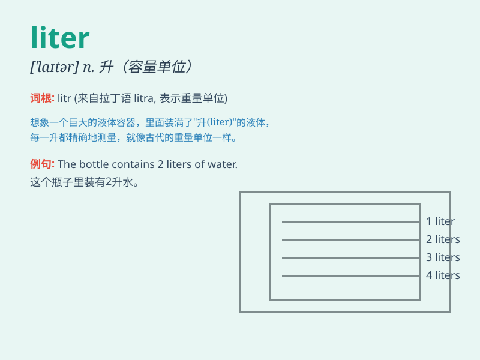

## liter

**英音:** _[ˈli:tə(r)]_ **美音:** _[litɚ]_

**译义:** *n.公升*

### 短语

+ **liter bottle:** _升瓶_

+ **per liter:** _每升_

+ **liter capacity:** _升容量_

+ **metric liter:** _公升_

+ **half liter:** _半升_

### 例句

#### 例句1

> **The bottle can hold one liter of water.**

**中文翻译:** 瓶子可容纳一升水。

**单词释义:** 升（容量单位）

#### 例句2

> **The car consumes about eight liters of fuel per 100
kilometers.**

**中文翻译:** 该车每100公里消耗约8升燃油。

**单词释义:** 升（容量单位）

#### 例句3

> **She bought two liters of milk from the supermarket.**

**中文翻译:** 她从超市买了两升牛奶。

**单词释义:** 升（容量单位）

### 背诵小故事

> A thirsty traveler was lost in the desert. He finally found a liter
of water hidden in an old hut. That liter of water saved his life.

**一位口渴的旅行者在沙漠中迷路了。他最终在一个旧棚屋里发现了一升水。那一升水救了他的命。**

### 图义

