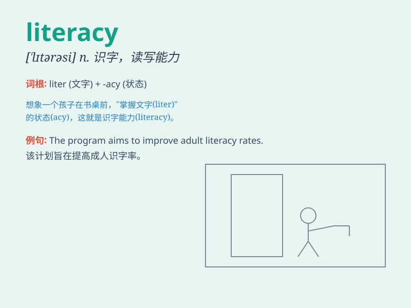

## literacy

**英音:** _[\'lɪt(ə)rəsɪ]_ **美音:** _[\'lɪtərəsi]_

**译义:** *n.有文化,有教养,有读写能力*

### 短语

+ **literacy rate:** _识字率；文化水平_

+ **computer literacy:** _计算机文化；计算机素养_

+ **media literacy:** _媒体素养；媒介素养_

+ **visual literacy:** _视觉素养；视觉文化_

+ **financial literacy:** _金融知识；金融素养_

### 例句

#### 例句1

> **The literacy rate in this country has significantly improved over
the past decade.**

**中文翻译:** 过去十年来，这个国家的识字率显着提高。

**单词释义:** 识字，读写能力

#### 例句2

> **Computer literacy is becoming increasingly important in the
modern workplace.**

**中文翻译:** 计算机知识在现代工作场所变得越来越重要。

**单词释义:** 读写能力

#### 例句3

> **She is passionate about promoting literacy among children in
rural areas.**

**中文翻译:** 她热衷于提高农村地区儿童的识字率。

**单词释义:** 识字，有文化

### 背诵小故事

> In a small village, there was a girl named Lily. She was passionate
about reading and writing. Through her efforts, she achieved high
literacy and could understand many complex books. Her literacy opened up
a new world for her.

**在一个小村庄里，有个叫莉莉的女孩。她热衷于阅读和写作。通过努力，她具备了很高的读写能力，能够读懂很多复杂的书籍。她的读写能力为她打开了一个新世界。**

### 图义

