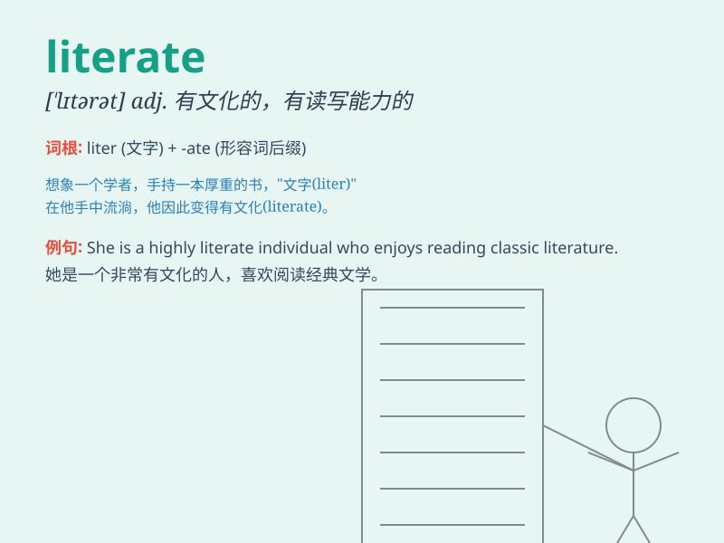

## literate

**英音:** _[\'lɪt(ə)rət]_ **美音:** _[\'lɪtərət]_

**译义:** *n.学者adj.有文化的,有阅读和写作能力的*

### 短语

+ **computer literate:** _懂电脑；会使用电脑_

+ **functionally literate:** _具备实用读写能力的_

+ **highly literate:** _有很高文化水平的_

+ **literate population:** _有文化的人口_

+ **become literate:** _变得有文化；学会读写_

### 例句

#### 例句1

> **She is a highly literate woman who loves reading classic
novels.**

**中文翻译:** 她是一位文化程度很高、喜爱阅读经典小说的女性。

**单词释义:** 有文化的；有读写能力的

#### 例句2

> **In this modern society, being literate is essential for
success.**

**中文翻译:** 在这个现代社会，识字对于成功至关重要。

**单词释义:** 有文化的；有读写能力的

#### 例句3

> **The literate population in this country has been steadily
increasing.**

**中文翻译:** 这个国家的识字人口一直在稳步增长。

**单词释义:** 有文化的；有读写能力的

### 背诵小故事

> A young boy was determined to become literate. He spent hours reading
and writing every day. Finally, his hard work paid off, and he could
understand and express himself well through words. Now he was truly
literate!

**一个小男孩决心要变得有文化。他每天都花数小时阅读和写作。最终，他的努力得到了回报，他能够很好地通过文字理解和表达自己。现在他真的是有文化的了！**

### 图义

