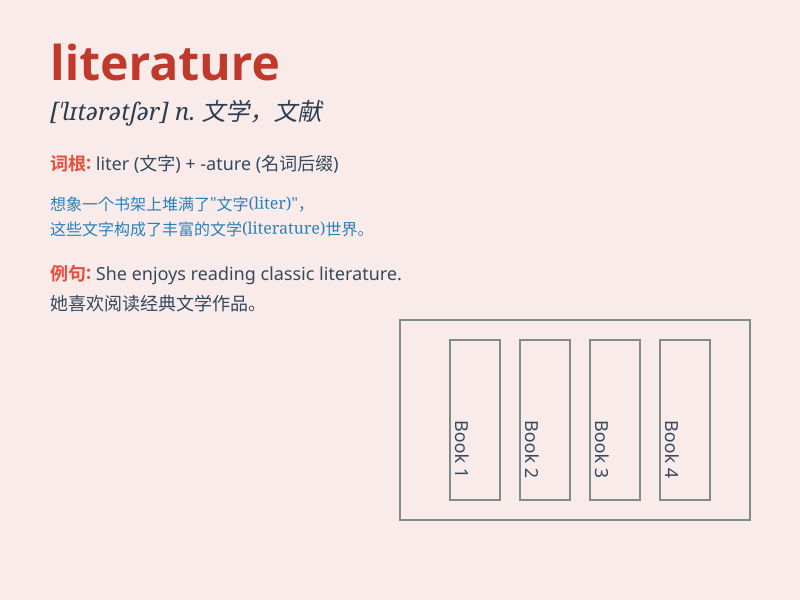

## literature

**英音:** _[\'lɪt(ə)rətʃə]_ **美音:** _[lɪtərəˌtʃʊr]_

**译义:** *n.文学(作品),文艺,著作,文献*

### 短语

+ **classical literature:** _古典文学_

+ **contemporary literature:** _当代文学_

+ **world literature:** _世界文学_

+ **children\'s literature:** _儿童文学_

+ **popular literature:** _通俗文学_

### 例句

#### 例句1

> **She is an expert in modern literature.**

**中文翻译:** 她是现代文学专家。

**单词释义:** 文学；文学作品

#### 例句2

> **The literature on this subject is extensive.**

**中文翻译:** 关于这个主题的文献非常广泛。

**单词释义:** 文献；资料

#### 例句3

> **He has published several works of literature.**

**中文翻译:** 他出版了多部文学作品。

**单词释义:** 文学作品

### 背诵小故事

> Once upon a time, a young student loved reading all kinds of books.
From novels to poems, he explored them all. He realized this collection
of written works was what we call \'literature\', a world of imagination
and knowledge.

**从前，有一个年轻的学生喜欢读各种各样的书。从小说到诗歌，他都探索了个遍。他意识到这些书面作品的集合就是我们所说的"文学"，一个充满想象和知识的世界。**

### 图义

