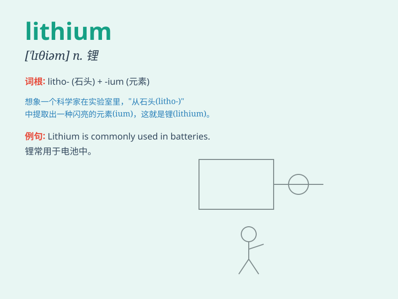

## lithium

**英音:** _[\'lɪθɪəm]_ **美音:** _[\'lɪθɪəm]_

**译义:** *n.[化] 锂*

### 短语

+ **lithium battery:** _锂电池_

+ **lithium ion:** _锂离子_

+ **lithium carbonate:** _碳酸锂_

+ **lithium hydroxide:** _氢氧化锂_

+ **lithium chloride:** _氯化锂_

### 例句

#### 例句1

> **Lithium is used in the production of batteries.**

**中文翻译:** 锂用于电池的生产。

**单词释义:** 锂（一种化学元素）

#### 例句2

> **The doctor prescribed lithium to treat his mental illness.**

**中文翻译:** 医生开了锂来治疗他的精神疾病。

**单词释义:** 锂（一种药物成分）

#### 例句3

> **Lithium compounds have unique chemical properties.**

**中文翻译:** 锂化合物具有独特的化学性质。

**单词释义:** 锂

### 背诵小故事

> A scientist was working in the lab. One day, he discovered a special
element that was light and had amazing properties. He named it
\'lithium\'. It was like a magic key to new technologies.

**一位科学家在实验室工作。有一天，他发现了一种特殊的元素，它很轻并且具有惊人的特性。他将其命名为"锂"。它就像是开启新技术的神奇钥匙。**

### 图义

