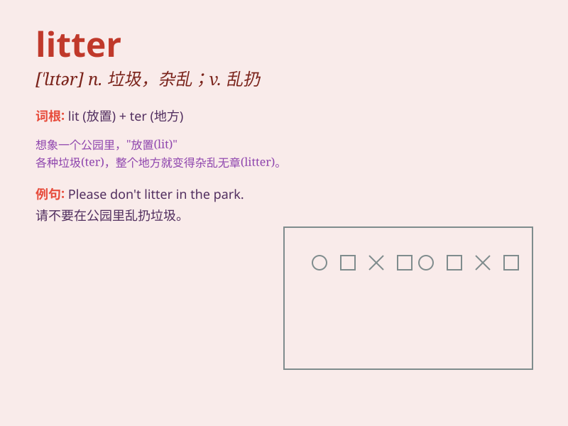

## litter

**英音:** _[\'lɪtə]_ **美音:** _[\'lɪtɚ]_

**译义:**
*n.垃圾,(供动物睡眠或防冻用的)干草、树叶,(一)窝,轿,担架vt.乱丢,铺草,弄乱vi.产仔,乱丢垃圾*

### 短语

+ **litter bin:** _垃圾桶；废物箱_

+ **litter box:** _猫砂盆_

+ **litter up:** _使杂乱；乱扔_

+ **litter with:** _使布满；使充满_

+ **a litter of:** _一窝（幼崽）_

### 例句

#### 例句1

> **The park was littered with trash.**

**中文翻译:** 这个公园到处都是垃圾。

**单词释义:** 布满，到处都是

#### 例句2

> **Don\'t litter in public places.**

**中文翻译:** 不要在公共场所乱扔垃圾。

**单词释义:** 乱扔

#### 例句3

> **She picked up the litter on the street.**

**中文翻译:** 她捡起了街上的垃圾。

**单词释义:** 垃圾

### 背诵小故事

> A little cat was playing in the park. It saw much litter everywhere.
The cat felt sad and decided to clean it up. With its efforts, the park
became clean again. Remember, don\'t litter!

**一只小猫在公园里玩耍。它看到到处都是垃圾。小猫感到难过并决定清理干净。在它的努力下，公园再次变得干净了。记住，不要乱扔垃圾！**

### 图义

