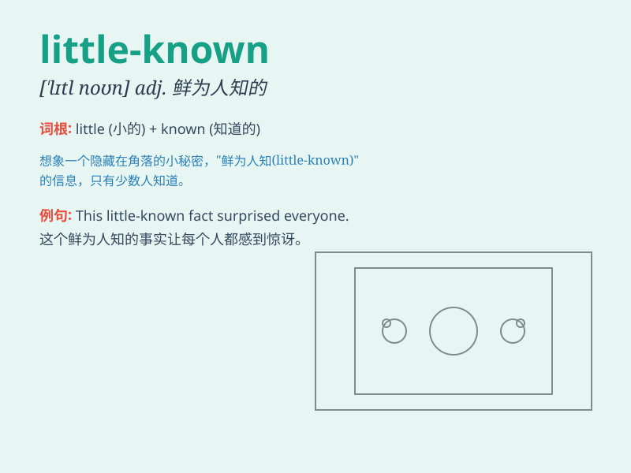

## little-known

**英音:** _[ˈlɪtl noʊn]_ **美音:** _[ˈlɪtl noʊn]_

**译义:** *adj. 鲜为人知的；不著名的*

### 短语

+ **little-known fact:** _鲜为人知的事实_

+ **little-known place:** _鲜为人知的地方_

+ **little-known author:** _名不见经传的作者_

+ **little-known artist:** _默默无闻的艺术家_

+ **little-known story:** _不为人知的故事_

### 例句

#### 例句1

> **The little-known artist suddenly gained international
recognition.**

**中文翻译:** 这位鲜为人知的艺术家突然获得了国际认可。

**单词释义:** 鲜为人知的

#### 例句2

> **He discovered a little-known fact about the history of the
town.**

**中文翻译:** 他发现了关于这个城镇历史的一个鲜为人知的事实。

**单词释义:** 鲜为人知的

#### 例句3

> **The little-known book turned out to be a hidden gem.**

**中文翻译:** 这本鲜为人知的书结果是一颗被埋没的珍宝。

**单词释义:** 鲜为人知的

### 背诵小故事

> A young explorer found a little-known cave. No one had discovered it
before. It was a secret place full of mystery. He felt so lucky to be
the first to know this special cave.

**一位年轻的探险家发现了一个鲜为人知的洞穴。之前没有人发现过它。这是一个充满神秘的秘密之地。他觉得自己能成为第一个知晓这个特别洞穴的人很幸运。**

### 图义

