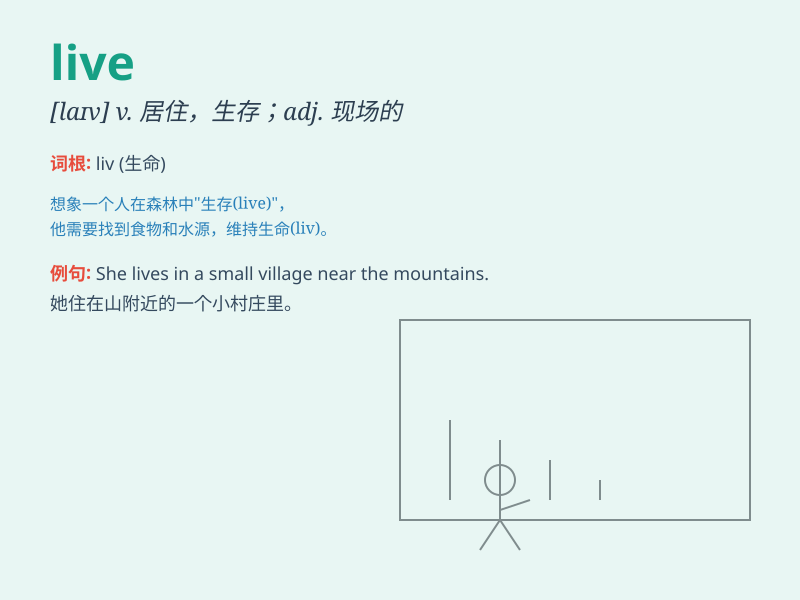

## live

**英音:** _[laɪv；lɪv]_ **美音:** _[laɪv；lɪv]_

**译义:**
*adj.活的,生动的,精力充沛的,实况转播的,点燃的vi.活着,生活,居住,流在人们记忆中vt.过着,度过,经历adv.以实况地*

### 短语

+ **live in:** _居住在；住在_

+ **live up to:** _不辜负；达到；符合_

+ **live with:** _忍受；与\...一起生活_

+ **live on:** _以\...为生；继续活着_

+ **live through:** _经历；度过_

### 例句

#### 例句1

> **I live in a big city.**

**中文翻译:** 我住在一个大城市。

**单词释义:** 居住

#### 例句2

> **The concert was broadcast live on TV.**

**中文翻译:** 这场音乐会在电视上现场直播。

**单词释义:** 现场直播的

#### 例句3

> **She has a live-in partner.**

**中文翻译:** 她有一个同居的伴侣。

**单词释义:** （与...）同居的

### 背诵小故事

> A little mouse lives in a big house. It loves to explore every corner
and finds joy in its daily life. One day, it discovers a hidden treat
and feels so happy. \'Live\' means to have a life and exist.

**一只小老鼠住在一个大房子里。它喜欢探索每个角落，并在日常生活中找到快乐。有一天，它发现了一个隐藏的美食，感到非常高兴。\'live\'的意思是生存，生活，存在。**

### 图义

