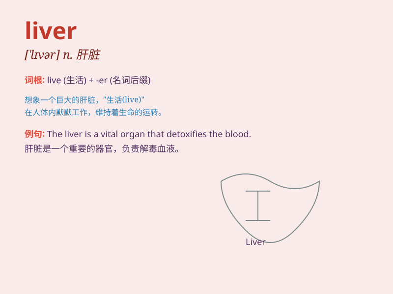

## liver

**英音:** _[\'lɪvə]_ **美音:** _[\'lɪvɚ]_

**译义:** *n.居住者,生活优裕的人,肝脏*

### 短语

+ **liver disease:** _肝脏疾病_

+ **liver transplant:** _肝脏移植_

+ **chicken liver:** _鸡肝_

+ **calf\'s liver:** _小牛肝_

+ **liver function:** _肝功能_

### 例句

#### 例句1

> **The doctor examined the patient\'s liver.**

**中文翻译:** 医生检查了病人的肝脏。

**单词释义:** 肝脏

#### 例句2

> **Chicken liver is a popular ingredient in many dishes.**

**中文翻译:** 鸡肝是许多菜肴中受欢迎的食材。

**单词释义:** 肝脏

#### 例句3

> **He has a weak liver and needs to avoid alcohol.**

**中文翻译:** 他肝脏不好，需要戒酒。

**单词释义:** 肝脏

### 背诵小故事

> The little mouse was very hungry and decided to go into a big house.
It found a big liver on the table and was so happy. But before it could
eat, the owner came back. Poor mouse!

**小老鼠非常饿，决定进入一个大房子。它在桌子上发现了一个大肝脏，非常高兴。但在它能吃之前，主人回来了。可怜的老鼠！**

### 图义

