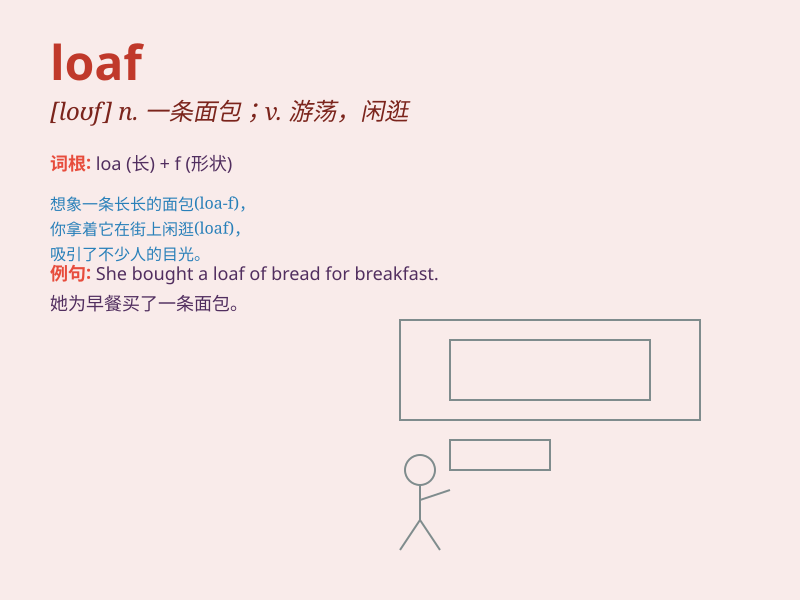

## loaf

**英音:** _[ləʊf]_ **美音:** _[lof]_

**译义:** *n.一条面包,块,游荡v.游荡,虚度光阴*

### 短语

+ **loaf of bread:** _一条面包_

+ **loaf around:** _游手好闲；闲逛_

+ **meat loaf:** _肉糕；肉馅糕_

+ **loaf on the job:** _磨洋工；工作偷懒_

+ **loaf sugar:** _块状糖_

### 例句

#### 例句1

> **He bought a loaf of bread from the bakery.**

**中文翻译:** 他从面包店买了一条面包。

**单词释义:** 一条（面包）

#### 例句2

> **Don\'t loaf around all day; do something productive.**

**中文翻译:** 别整天游手好闲的，做点有意义的事。

**单词释义:** 游荡；闲逛

#### 例句3

> **She was accused of loafing on the job.**

**中文翻译:** 她被指责在工作中偷懒。

**单词释义:** 偷懒；混日子

### 背诵小故事

> A poor man was starving. One day, he found a loaf of bread on the
street. It was like a treasure to him and saved him from hunger.
Remember, loaf means a block of bread!

**一个穷人正在挨饿。有一天，他在街上发现了一条面包。这对他来说就像宝藏，让他免于饥饿。记住，loaf
意思是一条面包！**

### 图义

