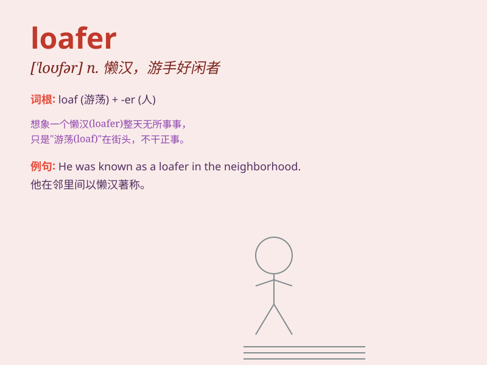

## loafer

**英音:** _[\'ləʊfə]_ **美音:** _[\'lofɚ]_

**译义:** *n.流浪者*

### 短语

+ **loafer shoes:** _休闲鞋_

+ **leather loafer:** _皮革乐福鞋_

+ **penny loafer:** _硬币口乐福鞋_

+ **tassel loafer:** _流苏乐福鞋_

+ **platform loafer:** _厚底乐福鞋_

### 例句

#### 例句1

> **He is just a loafer who never does any useful work.**

**中文翻译:** 他只是一个从不做任何有用工作的游手好闲者。

**单词释义:** 游手好闲的人

#### 例句2

> **The loafer spent the whole day idling in the park.**

**中文翻译:** 这个懒汉一整天都在公园里闲逛。

**单词释义:** 懒汉

#### 例句3

> **Don\'t be a loafer and start working hard for your future.**

**中文翻译:** 别当一个游手好闲的人，为你的未来努力工作吧。

**单词释义:** 游手好闲者

### 背诵小故事

> A young man named Tom was always seen wandering the streets without a
job. People called him a loafer. One day, he decided to change and found
a meaningful career. Now, he\'s no longer a loafer.

**一个叫汤姆的年轻人总是被看到在街上闲逛，没有工作。人们称他为游手好闲者。有一天，他决定改变，找到了一份有意义的职业。现在，他不再是个游手好闲的人了。**

### 图义

