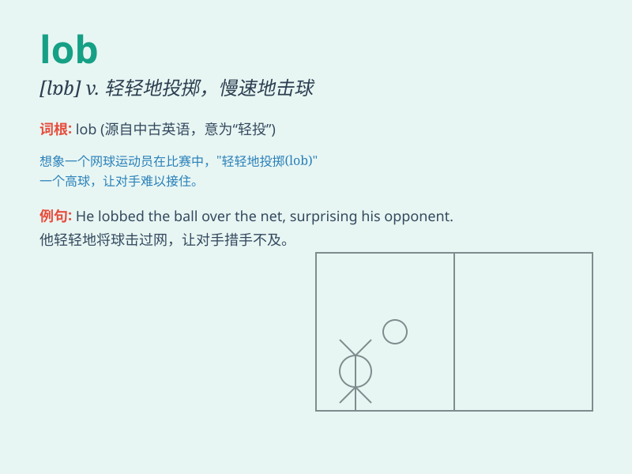

## lob

**英音:** _[lɒb]_ **美音:** _[lɑb]_

**译义:** *vt.打缓慢的球vi.蹒跚地走n.\<英方>
笨重的人,[网球]高球*

### 短语

+ **lob pass:** _高吊传球_

+ **lob shot:** _挑高球射门_

+ **lob wedge:** _高抛挖起杆_

+ **lob volley:** _高吊截击_

+ **lob the ball:** _把球挑高_

### 例句

#### 例句1

> **He lobbed the ball over the defender\'s head.**

**中文翻译:** 他把球高抛过了防守队员的头顶。

**单词释义:** 高抛；抛

#### 例句2

> **The tennis player lobbed the ball into the opponent\'s court.**

**中文翻译:** 这位网球运动员把球挑高打到了对手的场地。

**单词释义:** 挑高球

#### 例句3

> **She lobbed a grenade at the enemy.**

**中文翻译:** 她向敌人投掷了一枚手榴弹。

**单词释义:** 投掷；抛

### 背诵小故事

> A boy was playing tennis. He hit the ball hard, but it didn\'t go
over the net. Instead, it just lobbed slowly and landed on the other
side. The opponent easily caught it. \'Lob\' means to throw or hit
something in a high arc.

**一个男孩在打网球。他用力击球，但球没过网。相反，它只是缓慢地高抛过去，落在了另一边。对手轻松地接住了它。\'lob\'意思是以高弧线投掷或击球。**

### 图义

