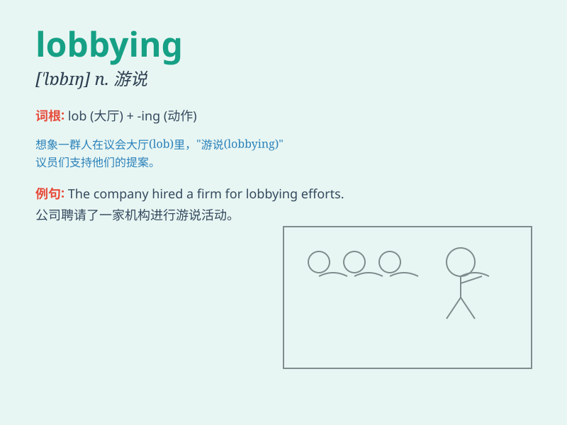

## lobbying

**英音:** _[ˈlɒbiɪŋ]_ **美音:** _[ˈlɑːbiɪŋ]_

**译义:** *n.游说活动 v.进行游说（lobby 的现在分词）*

### 短语

+ **lobbying effort:** _游说努力_

+ **lobbying group:** _游说团体_

+ **lobbying campaign:** _游说活动_

+ **intense lobbying:** _强烈的游说_

+ **effective lobbying:** _有效的游说_

### 例句

#### 例句1

> **The company has been accused of intense lobbying to influence the
new legislation.**

**中文翻译:** 这家公司被指控为影响新法规进行了激烈的游说活动。

**单词释义:** 游说活动

#### 例句2

> **Lobbying by environmental groups led to stricter pollution
controls.**

**中文翻译:** 环保组织的游说导致了更严格的污染控制。

**单词释义:** 游说

#### 例句3

> **She is involved in lobbying for better working conditions for
employees.**

**中文翻译:** 她参与为员工争取更好工作条件的游说。

**单词释义:** 游说

### 背诵小故事

> A group of citizens were passionate about protecting the local park.
They spent days lobbying the government, meeting officials, and
presenting petitions. Finally, their efforts paid off and the park was
saved.

**一群市民热衷于保护当地的公园。他们花了好几天时间向政府进行游说，与官员会面，并提交请愿书。最终，他们的努力得到了回报，公园得以保留。**

### 图义

