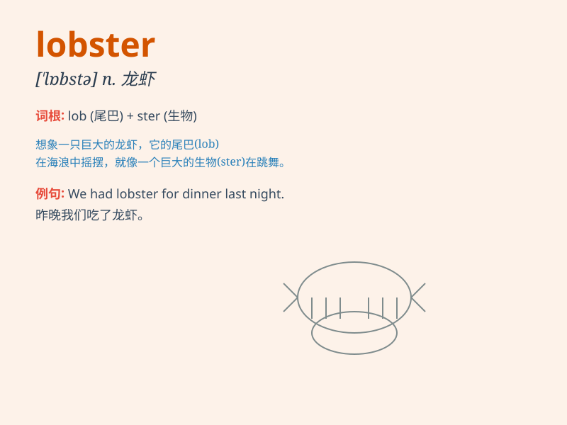

## lobster

**英音:** _[\'lɒbstə]_ **美音:** _[\'lɑbstɚ]_

**译义:** *n.龙虾*

### 短语

+ **lobster pot:** _捕龙虾的笼子_

+ **lobster tail:** _龙虾尾_

+ **rock lobster:** _岩龙虾_

+ **spiny lobster:** _刺龙虾_

+ **lobster fishery:** _龙虾渔业_

### 例句

#### 例句1

> **I had a delicious lobster for dinner last night.**

**中文翻译:** 昨晚我晚餐吃了一只美味的龙虾。

**单词释义:** 龙虾（指作为食物的龙虾）

#### 例句2

> **The fisherman caught several lobsters in his net.**

**中文翻译:** 这个渔夫用网捕到了几只龙虾。

**单词释义:** 龙虾（指活的龙虾）

#### 例句3

> **The lobster\'s claws were very sharp.**

**中文翻译:** 这只龙虾的爪子非常锋利。

**单词释义:** 龙虾

### 背诵小故事

> A little boy went to the beach and saw a strange creature. His father
told him it was a lobster. The lobster had big claws and a hard shell.
The boy was amazed and never forgot what a lobster looked like.

**一个小男孩去海滩，看到了一个奇怪的生物。他的父亲告诉他这是一只龙虾。龙虾有大钳子和坚硬的壳。男孩很惊讶，永远忘不了龙虾的样子。**

### 图义

