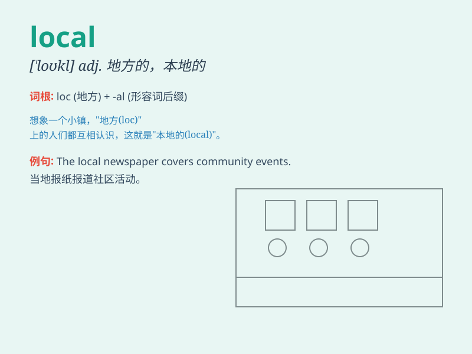

## local

**英音:** _[\'ləʊk(ə)l]_ **美音:** _[ˈloʊkl]_

**译义:**
*adj.地方的,当地的,局部的,乡土的n.当地居民,本地新闻,慢车,局部*

### 短语

+ **local area:** _本地区域_

+ **local government:** _地方政府_

+ **local time:** _当地时间_

+ **local resident:** _当地居民_

+ **local customs:** _当地风俗_

### 例句

#### 例句1

> **I prefer to shop at local stores.**

**中文翻译:** 我更喜欢在当地商店购物。

**单词释义:** 当地的

#### 例句2

> **The local people are very friendly.**

**中文翻译:** 当地人非常友好。

**单词释义:** 当地的

#### 例句3

> **There is a local bus service in this town.**

**中文翻译:** 该镇有当地巴士服务。

**单词释义:** 当地的

### 背诵小故事

> A traveler got lost in a strange town. He asked a friendly local for
directions. The local knew every street and corner and helped the
traveler find his way. The traveler was grateful for the local\'s
knowledge.

**一位旅行者在一个陌生的城镇迷路了。他向一位友好的当地人问路。这位当地人熟悉每一条街道和角落，并帮助旅行者找到了路。旅行者很感激这位当地人的知识。**

### 图义

