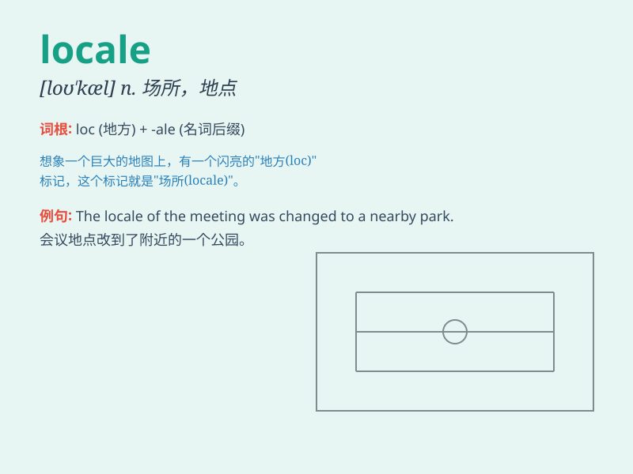

## locale

**英音:** _[ləʊ\'kɑːl]_ **美音:** _[lo\'kæl]_

**译义:** *n.现场,场所*

### 短语

+ **locale setting:** _区域设置_

+ **default locale:** _默认区域_

+ **change locale:** _更改区域_

+ **locale information:** _区域信息_

+ **select locale:** _选择区域_

### 例句

#### 例句1

> **The festival was held in a beautiful locale by the river.**

**中文翻译:** 节日在河边美丽的地方举行。

**单词释义:** 地点；场所

#### 例句2

> **This locale is perfect for a romantic picnic.**

**中文翻译:** 这个地方非常适合浪漫野餐。

**单词释义:** 地点；场所

#### 例句3

> **The software can be customized based on the user\'s locale.**

**中文翻译:** 该软件可以根据用户的区域设置进行定制。

**单词释义:** （事件发生的）地点；现场

### 背诵小故事

> Once upon a time, a traveler was lost in a strange locale. He asked
locals for directions and finally found his way. The locale had unique
features that made it memorable.

**从前，有一位旅行者在一个陌生的地点迷路了。他向当地人问路，最终找到了出路。这个地点有着独特的特征，令人难以忘怀。**

### 图义

