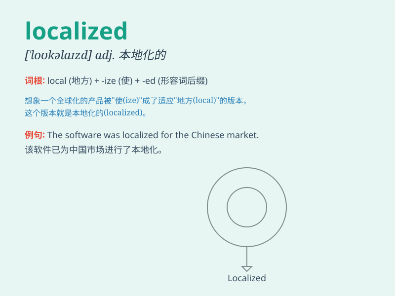

## localized

**英音:** _[ˈləʊkəlaɪzd]_ **美音:** _[ˈloʊkəlaɪzd]_

**译义:** *adj.局部的；地区的；小范围的*

### 短语

+ **localized infection:** _局部感染_

+ **localized pain:** _局部疼痛_

+ **localized damage:** _局部损坏_

+ **localized effect:** _局部效应_

+ **localized resource:** _本地资源_

### 例句

#### 例句1

> **The problem was localized to a specific area of the machine.**

**中文翻译:** 这个问题被局限在机器的一个特定区域。

**单词释义:** 局限；限制

#### 例句2

> **The infection remained localized and did not spread throughout
the body.**

**中文翻译:** 感染仍局限在一处，没有扩散到全身。

**单词释义:** 局限；局部的

#### 例句3

> **We need to find a way to localized the source of the error.**

**中文翻译:** 我们需要找到一种方法来定位错误的来源。

**单词释义:** 定位；找出......的位置

### 背诵小故事

> A traveler got lost in a strange town. But luckily, he found a
localized guide who knew every corner and helped him find his way. The
guide was familiar with the local area. So \'localized\' means limited
to a particular area.

**一位旅行者在一个陌生的城镇迷路了。但幸运的是，他找到了一位熟悉当地情况的本地向导，帮助他找到了路。这位向导对当地很熟悉。所以\'localized\'意思是局限于某一特定区域。**

### 图义

