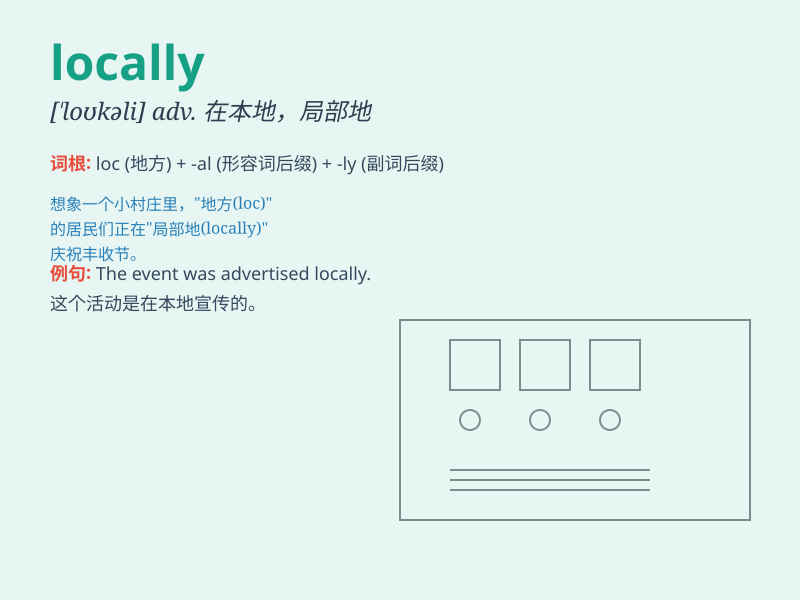

## locally

**英音:** _[\'ləʊkəlɪ]_ **美音:** _[\'lokəli]_

**译义:** *adv.在地方上,在本地,局部地,本地性*

### 短语

+ **locally produced:** _本地生产的_

+ **locally sourced:** _本地采购的_

+ **locally available:** _本地可获得的_

+ **locally famous:** _在当地出名的_

+ **locally owned:** _本地拥有的_

### 例句

#### 例句1

> **The produce is grown locally and sold in the nearby markets.**

**中文翻译:** 产品在当地种植并在附近市场出售。

**单词释义:** 在当地

#### 例句2

> **She prefers to shop locally for fresh food.**

**中文翻译:** 她更喜欢在当地购买新鲜食品。

**单词释义:** 在本地

#### 例句3

> **The problem was solved locally without the need for outside
intervention.**

**中文翻译:** 问题在本地得到解决，无需外部干预。

**单词释义:** 在当地

### 背诵小故事

> A traveler was lost in a strange town. He asked a local resident for
directions. The local person kindly showed him the way. \'Locally\',
here means in a particular local area.

**一位旅行者在一个陌生的城镇迷路了。他向一位当地居民问路。这位当地人友好地给他指路。\'locally\'在这里指在特定的当地区域。**

### 图义

