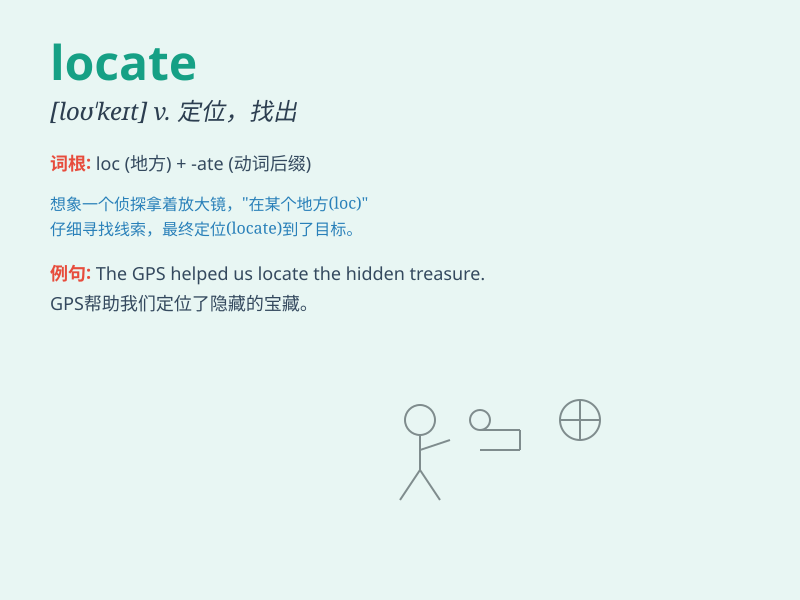

## locate

**英音:** _[lə(ʊ)\'keɪt]_ **美音:** _[ˈloˌket; loˈket]_

**译义:** *vt.查找\...的地点,使\...坐落于,位于v.定位,位于*

### 短语

+ **locate in:** _位于；坐落于_

+ **locate at:** _在\...\...定位；位于\...\..._

+ **locate near:** _位于\...\...附近_

+ **be located on:** _位于\...\...之上_

+ **locate between:** _位于\...\...之间_

### 例句

#### 例句1

> **The company is trying to locate new markets for its products.**

**中文翻译:** 该公司正在努力为其产品寻找新市场。

**单词释义:** 寻找，找到

#### 例句2

> **The police were able to locate the missing child within
hours.**

**中文翻译:** 警方在数小时内找到了失踪的孩子。

**单词释义:** 找到，确定\...的位置

#### 例句3

> **The factory is located in the suburbs.**

**中文翻译:** 工厂位于郊区。

**单词释义:** 位于，坐落于

### 背诵小故事

> A lost traveler was desperately trying to locate his destination. He
had a map but was confused. Finally, with the help of a kind local, he
found the right way. \'Locate\' means to find or discover the exact
place or position.

**一位迷路的旅行者拼命地试图找到他的目的地。他有一张地图但感到困惑。最后，在一位好心当地人的帮助下，他找到了正确的路。'locate'意思是找到或确定准确的地点或位置。**

### 图义

