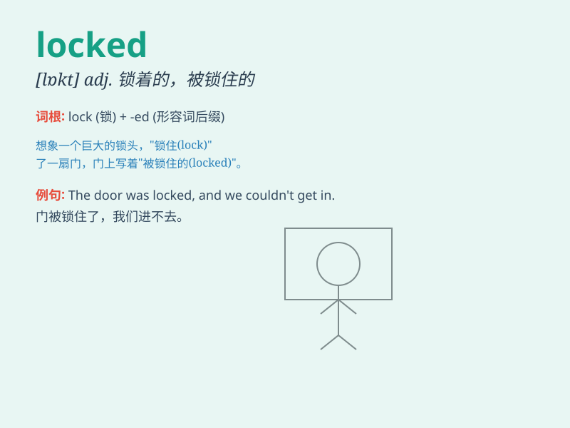

## locked

**英音:** _[lɒkt]_ **美音:** _[lɑːkt]_

**译义:** *adj.[计] 锁定的*

### 短语

+ **locked away:** _被锁起来；被藏起来_

+ **locked in:** _被锁住；被困住_

+ **locked out:** _被锁在外面_

+ **locked up:** _被监禁；被锁住_

+ **stay locked:** _保持锁定状态_

### 例句

#### 例句1

> **The door was locked and I couldn\'t get in.**

**中文翻译:** 门锁着，我进不去。

**单词释义:** 锁着的

#### 例句2

> **My phone is locked and I forgot the password.**

**中文翻译:** 我的手机被锁了，我忘记了密码。

**单词释义:** 被锁定的

#### 例句3

> **The safe was locked securely to protect the valuables inside.**

**中文翻译:** 保险箱被牢牢锁住，以保护里面的贵重物品。

**单词释义:** 锁着的；上了锁的

### 背诵小故事

> One day, Tom was in a hurry to get into his room but found the door
locked. He had forgotten the key. After searching everywhere, he finally
found it in his pocket and unlocked the door happily.

**一天，汤姆着急进房间却发现门被锁上了。他忘记带钥匙了。到处找之后，他终于在口袋里找到了，然后开心地打开了门。**

### 图义

