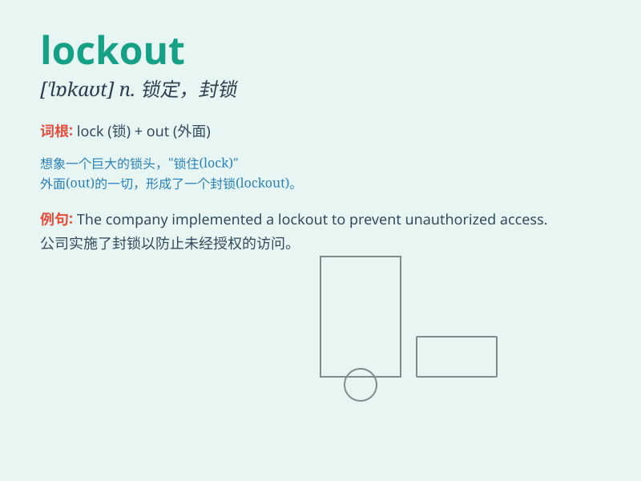

## lockout

**英音:** _[ˈlɒkaʊt]_ **美音:** _[ˈlɑːkaʊt]_

**译义:** *n.停工(业主为抵制工人的要求而停工)*

### 短语

+ **employee lockout:** _员工被关在厂外（雇主不让员工进厂工作）_

+ **factory lockout:** _工厂停工（雇主关闭工厂不让员工工作）_

+ **lockout period:** _封锁期；禁止期_

+ **lockout device:** _锁定装置_

+ **prevent lockout:** _防止封锁_

### 例句

#### 例句1

> **The workers went on strike, leading to a lockout by the
management.**

**中文翻译:** 工人们举行罢工，导致管理层停工。

**单词释义:** 封锁，关闭

#### 例句2

> **The lockout of the factory lasted for several weeks.**

**中文翻译:** 工厂的封锁持续了数周。

**单词释义:** 封锁

#### 例句3

> **The sports team\'s owner initiated a lockout to force the players
to accept new contract terms.**

**中文翻译:** 运动队老板发起停摆，迫使球员接受新的合同条款。

**单词释义:** 封锁，禁止进入

### 背诵小故事

> A factory owner decided to do a lockout. Workers were not allowed in
because of a labor dispute. It caused a big problem. But in the end,
they found a solution. Remember, lockout means to prevent workers from
entering a place of work.

**一家工厂的老板决定进行停工闭厂。由于劳资纠纷，工人不被允许进入。这引发了一个大问题。但最后，他们找到了一个解决方案。记住，lockout
意思是不让工人进入工作场所。**

### 图义

