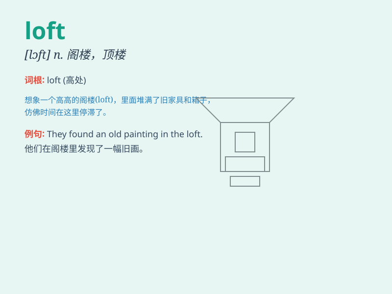

## loft

**英音:** _[lɒft]_ **美音:** _[lɔft]_

**译义:** *n.阁楼*

### 短语

+ **loft apartment:** _阁楼公寓_

+ **loft conversion:** _阁楼改造_

+ **loft bed:** _高架床_

+ **loft space:** _阁楼空间_

+ **hay loft:** _干草棚_

### 例句

#### 例句1

> **The artist has a loft in the city where he creates his
masterpieces.**

**中文翻译:** 这位艺术家在城里有一个阁楼，他在那里创作他的杰作。

**单词释义:** 阁楼；顶楼

#### 例句2

> **The pigeon loft is at the top of the barn.**

**中文翻译:** 鸽子棚在谷仓的顶部。

**单词释义:** 鸽房

#### 例句3

> **He hit the ball into the loft of the golf course.**

**中文翻译:** 他把球打到了高尔夫球场的高空中。

**单词释义:** （高尔夫球的）高击，高打

### 背诵小故事

> A young artist was struggling to find a place to create. One day, he
discovered an abandoned loft with big windows and high ceilings. It
became his perfect studio. The loft gave him inspiration and space to
express his art.

**一位年轻的艺术家一直在努力寻找创作的地方。有一天，他发现了一个废弃的阁楼，有大窗户和高高的天花板。它成了他完美的工作室。这个阁楼给了他灵感和空间来表达他的艺术。**

### 图义

