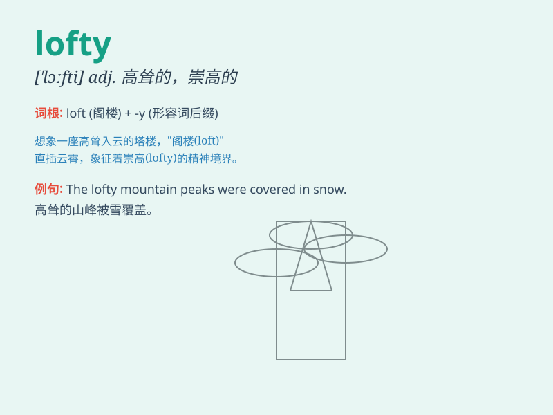

## lofty

**英音:** _[\'lɒftɪ]_ **美音:** _[\'lɔfti]_

**译义:** *adj.高高的,崇高的,高傲的,高级的*

### 短语

+ **lofty ideal:** _崇高的理想_

+ **lofty ambition:** _远大的抱负_

+ **lofty mountain:** _巍峨的山_

+ **lofty goal:** _崇高的目标_

+ **lofty tower:** _高耸的塔_

### 例句

#### 例句1

> **The lofty mountains stand majestically against the sky.**

**中文翻译:** 巍峨的高山雄伟地耸立在天空下。

**单词释义:** 高耸的；高大的

#### 例句2

> **He has lofty ideals and is determined to achieve them.**

**中文翻译:** 他有崇高的理想，并决心去实现它们。

**单词释义:** 崇高的；高尚的

#### 例句3

> **The building has a lofty ceiling, making it feel spacious.**

**中文翻译:** 这座建筑有高高的天花板，让人感觉很宽敞。

**单词释义:** 高的

### 背诵小故事

> A young bird wanted to reach the lofty peak. It kept flying despite
the difficulties. Finally, it stood on the top and saw the beautiful
view. \'Lofty\' means very high and noble.

**一只小鸟想要到达高耸的山峰。它不顾困难一直飞。最终，它站在了山顶看到了美丽的景色。\'lofty\'意思是高耸的、崇高的。**

### 图义

