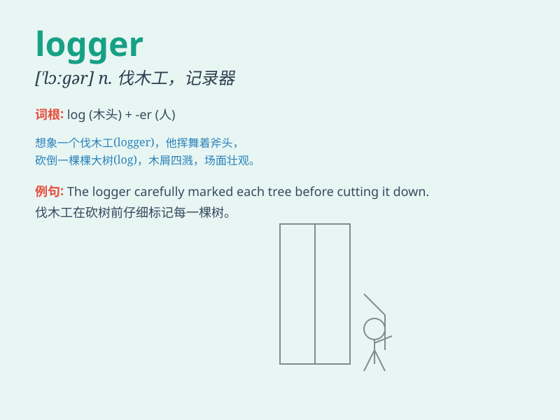

## logger

**英音:** _[\'lɒgə]_ **美音:** _[\'lɔɡɚ]_

**译义:** *n.樵夫,圆木装车机*

### 短语

+ **data logger:** _数据记录器_

+ **event logger:** _事件记录器_

+ **system logger:** _系统记录器_

+ **loggerhead turtle:** _蠵龟_

+ **logger head:** _笨人；呆子_

### 例句

#### 例句1

> **The logger chopped down the tree with an axe.**

**中文翻译:** 这位伐木工用斧头砍倒了那棵树。

**单词释义:** 伐木工

#### 例句2

> **The software logger records all the system activities.**

**中文翻译:** 这个软件记录器记录了所有的系统活动。

**单词释义:** 记录器

#### 例句3

> **The logger was exhausted after a long day of work in the
forest.**

**中文翻译:** 在森林里工作了一整天后，这位伐木工筋疲力尽。

**单词释义:** 伐木工

### 背诵小故事

> In the deep forest, a logger was hard at work cutting down trees. But
he knew he had to do it carefully to avoid harming the little animals\'
homes. The logger\'s job was both tough and important.

**在幽深的森林里，一位伐木工人正在努力砍伐树木。但他知道他必须小心行事，以免损害小动物们的家园。这位伐木工人的工作既艰难又重要。**

### 图义

