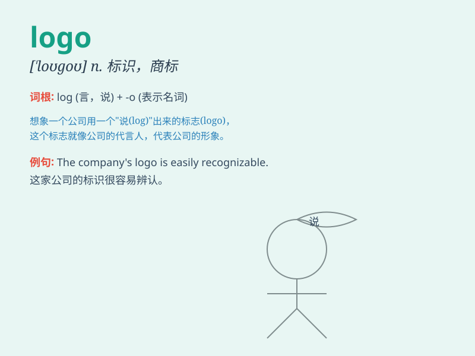

## logo

**英音:** _[\'lɒgəʊ; \'ləʊgəʊ]_ **美音:** _[\'loɡo]_

**译义:** *n.标识语 Logo教学语言*

### 短语

+ **company logo:** _公司标志_

+ **brand logo:** _品牌标识_

+ **website logo:** _网站标识_

+ **corporate logo:** _企业标志_

+ **product logo:** _产品标识_

### 例句

#### 例句1

> **The company\'s logo is very distinctive and easily
recognizable.**

**中文翻译:** 这家公司的标识非常独特，很容易识别。

**单词释义:** 标识；标志

#### 例句2

> **We need to redesign our logo to make it more modern.**

**中文翻译:** 我们需要重新设计我们的标识，使其更具现代感。

**单词释义:** 标识；标志

#### 例句3

> **The new logo represents the brand\'s values and mission.**

**中文翻译:** 新的标识代表了这个品牌的价值观和使命。

**单词释义:** 标识；标志

### 背诵小故事

> A company was in a big trouble as they had no unique sign to
represent them. Then a genius designer created a wonderful symbol, and
they called it \'logo\', which made the company famous.

**一家公司陷入了大麻烦，因为他们没有独特的标志来代表自己。然后一位天才设计师创造了一个很棒的符号，他们称之为"标志"，这让公司出名了。**

### 图义

