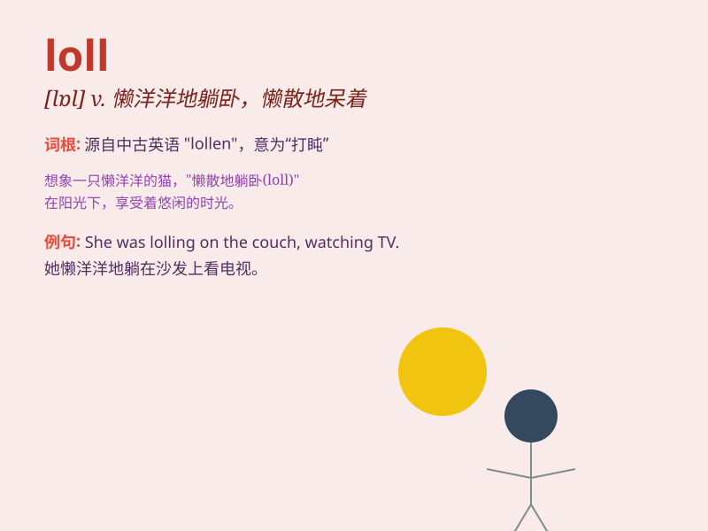

## loll

**英音:** _[lɒl]_ **美音:** _[lɑl]_

**译义:** *v.懒洋洋地倚靠*

### 短语

+ **loll about:** _懒洋洋地闲荡_

+ **loll around:** _到处闲逛_

+ **loll out:** _伸出，耷拉着_

+ **loll back:** _向后倚靠_

+ **loll forward:** _向前倾靠_

### 例句

#### 例句1

> **The dog was lolling its tongue out in the heat.**

**中文翻译:** 这只狗在炎热中伸出舌头耷拉着。

**单词释义:** 耷拉，伸出

#### 例句2

> **He was lolling in the chair, looking very relaxed.**

**中文翻译:** 他懒洋洋地躺在椅子上，看起来非常放松。

**单词释义:** 懒洋洋地倚靠

#### 例句3

> **She lolled her head to one side, bored.**

**中文翻译:** 她把头歪向一边，感到无聊。

**单词释义:** 歪向，倾斜

### 背诵小故事

> A lazy dog was lolling in the sun. It had no energy to move and just
let its tongue hang out, enjoying the warmth. Suddenly, a ball rolled
nearby, but the dog just continued to loll there.

**一只慵懒的狗正懒洋洋地躺在阳光下。它没力气动，只是耷拉着舌头，享受着温暖。突然，一个球滚到附近，但这只狗还是继续在那懒洋洋地躺着。**

### 图义

