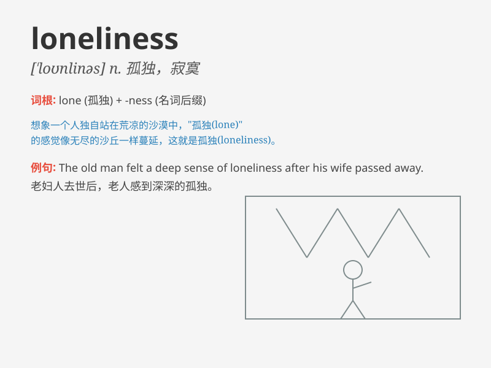

## loneliness

**英音:** _[\'ləʊnlɪnɪs]_ **美音:** _[\'lonlɪnɪs]_

**译义:** *n.孤独,寂寞*

### 短语

+ **sense of loneliness:** _孤独感_

+ **overcome loneliness:** _克服孤独_

+ **endless loneliness:** _无尽的孤独_

+ **deep loneliness:** _深深的孤独_

+ **bear loneliness:** _忍受孤独_

### 例句

#### 例句1

> **She often experiences loneliness when she is alone at home.**

**中文翻译:** 当她一个人在家时，她常常感到孤独。

**单词释义:** 孤独；寂寞

#### 例句2

> **The old man\'s loneliness was palpable in the empty house.**

**中文翻译:** 空荡荡的房子里，老人的孤独感溢于言表。

**单词释义:** 孤独；孤单

#### 例句3

> **Loneliness can have a negative impact on one\'s mental
health.**

**中文翻译:** 孤独会对一个人的心理健康产生负面影响。

**单词释义:** 孤独；孤寂

### 背诵小故事

> A little bird flew alone in the sky. It had no friends around,
feeling a deep sense of loneliness. It longed for companionship but
found none. This is what \'loneliness\' means - being alone and sad.

**一只小鸟独自在天空飞翔。它周围没有朋友，深深感受到孤独。它渴望陪伴却找不到。这就是'loneliness'的意思------独自一人且悲伤。**

### 图义

