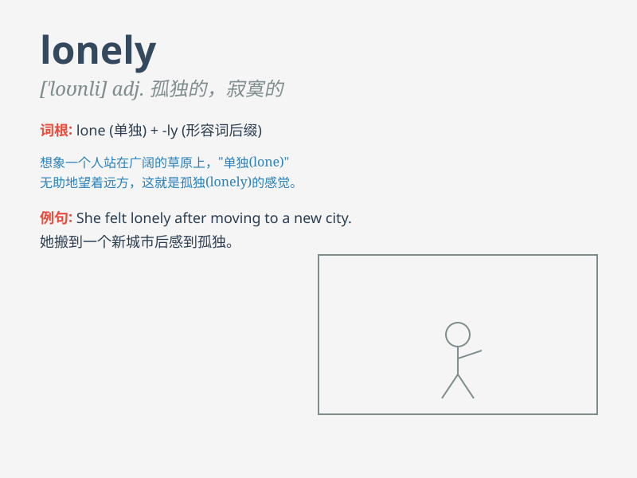

## lonely

**英音:** _[\'ləʊnlɪ]_ **美音:** _[\'lonli]_

**译义:** *adj.孤独的,寂寞的,偏僻的,人迹罕至的*

### 短语

+ **feel lonely:** _感到孤独_

+ **a lonely place:** _一个偏僻的地方_

+ **lonely heart:** _孤独的心_

+ **lonely island:** _孤岛_

+ **lonely traveller:** _孤独的旅行者_

### 例句

#### 例句1

> **She felt lonely in the big city.**

**中文翻译:** 她在大城市感到孤独。

**单词释义:** 孤独的；寂寞的

#### 例句2

> **The old man lives a lonely life.**

**中文翻译:** 老人过着孤独的生活。

**单词释义:** 孤独的；孤单的

#### 例句3

> **That is a lonely island.**

**中文翻译:** 那是一座孤岛。

**单词释义:** 偏僻的；荒凉的

### 背诵小故事

> A little star felt lonely in the vast universe. It shone alone, with
no companions nearby. But one day, it met another lonely star and they
became friends, no longer feeling lonely.

**一颗小星星在浩瀚的宇宙中感到孤独。它独自闪耀，附近没有同伴。但有一天，它遇到了另一颗孤独的星星，它们成为了朋友，不再感到孤独。**

### 图义

