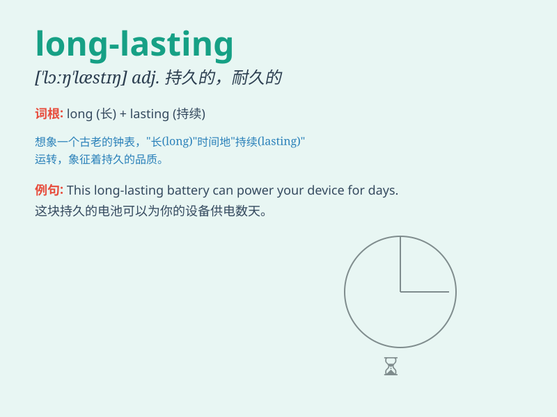

## long-lasting

**英音:** _[ˈlɒŋ.læs.tɪŋ]_ **美音:** _[ˈlɔŋ.læs.tɪŋ]_

**译义:** *持久的，长期的；耐用的，长时间存在的*

### 短语

+ **long-lasting friendship:** _持久的友谊_

+ **long-lasting effect:** _长期的影响_

+ **long-lasting relationship:** _长久的关系_

+ **long-lasting memory:** _长久的记忆_

+ **long-lasting solution:** _长期有效的解决办法_

### 例句

#### 例句1

> **This long-lasting lipstick doesn\'t come off easily.**

**中文翻译:** 这款持久的口红不容易掉色。

**单词释义:** 持久的

#### 例句2

> **The long-lasting friendship between them is very precious.**

**中文翻译:** 他们之间长久的友谊非常珍贵。

**单词释义:** 长久的

#### 例句3

> **We need to find a long-lasting solution to this problem.**

**中文翻译:** 我们需要找到一个持久的解决这个问题的办法。

**单词释义:** 持久的

### 背诵小故事

> A prince sought a long-lasting love. He traveled far and wide.
Finally, he found a kind princess and their love endured through years.
Their story became a symbol of long-lasting love.

**一位王子寻求长久的爱情。他四处游历。最终，他找到了一位善良的公主，他们的爱情历经多年。他们的故事成为了长久爱情的象征。**

### 图义

