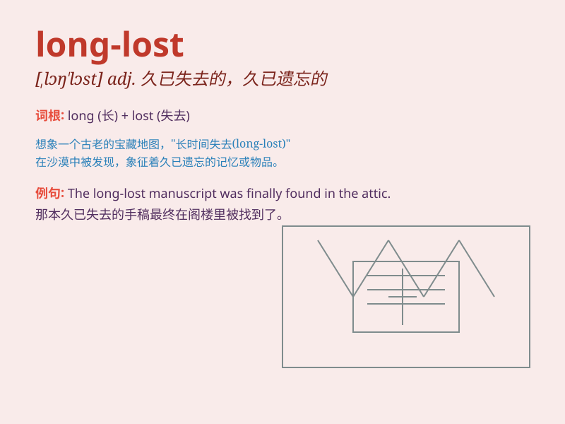

## long-lost

**英音:** _[ˌlɒŋ ˈlɒst]_ **美音:** _[ˌlɔːŋ ˈlɔːst]_

**译义:** *adj. 遗失很久的；早已失传的；久未联系的；阔别已久的*

### 短语

+ **long-lost friend:** _久违的朋友_

+ **long-lost relative:** _失散已久的亲戚_

+ **long-lost love:** _失去已久的爱情_

+ **long-lost memory:** _久远的回忆_

+ **long-lost hometown:** _久违的家乡_

### 例句

#### 例句1

> **I finally met my long-lost friend at the reunion.**

**中文翻译:** 我终于在聚会上见到了我失散已久的朋友。

**单词释义:** 失散已久的

#### 例句2

> **She found her long-lost sister through social media.**

**中文翻译:** 她通过社交媒体找到了她失散多年的姐姐。

**单词释义:** 失散多年的

#### 例句3

> **The man was overjoyed to discover his long-lost family
heirloom.**

**中文翻译:** 这个男人非常高兴地发现了他丢失已久的传家宝。

**单词释义:** 丢失已久的

### 背诵小故事

> A man was searching for his long-lost sister. After years of efforts,
he finally found her. The reunion was filled with joy and tears. They
had been apart for so long but their bond was still strong.

**一个男人一直在寻找他失散已久的妹妹。经过多年的努力，他终于找到了她。重逢充满了喜悦和泪水。他们分开了很久，但感情依旧深厚。**

### 图义

