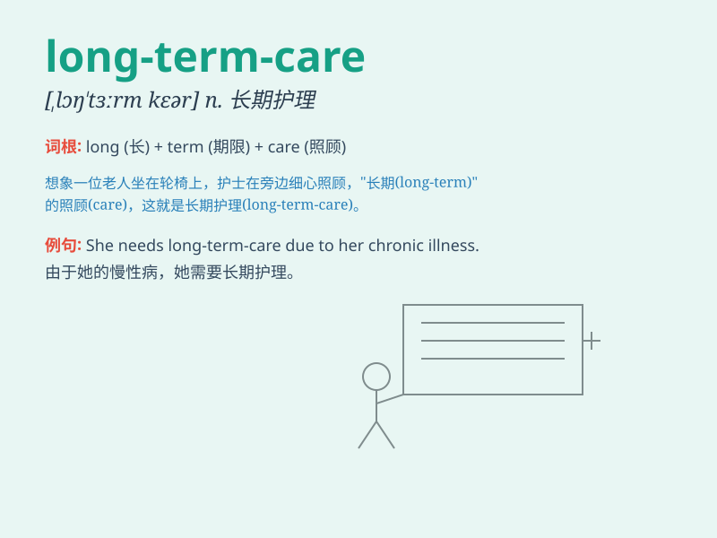

## long-term-care

**英音:** _[lɒŋ tɜːm keə]_ **美音:** _[lɔːŋ tɜːrm kɛr]_

**译义:**
*长期护理，指为需要长期医疗、康复或日常生活帮助的人提供的持续性护理服务。*

### 短语

+ **long-term-care insurance:** _长期护理保险_

+ **long-term-care facility:** _长期护理机构_

+ **long-term-care services:** _长期护理服务_

+ **long-term-care needs:** _长期护理需求_

+ **long-term-care planning:** _长期护理规划_

### 例句

#### 例句1

> **Long-term-care insurance is becoming increasingly important as
the population ages.**

**中文翻译:** 随着人口老龄化，长期护理保险变得越来越重要。

**单词释义:** 长期护理

#### 例句2

> **The government is working on improving the long-term-care system
for the elderly.**

**中文翻译:** 政府正在努力改善针对老年人的长期护理系统。

**单词释义:** 长期护理

#### 例句3

> **She is considering a career in long-term-care services.**

**中文翻译:** 她正在考虑从事长期护理服务方面的职业。

**单词释义:** 长期护理

### 背诵小故事

> A young man decided to work in long-term-care. He met many elderly
people and learned to care for them patiently. Through this job, he
understood the importance of long-term commitment and care.

**一个年轻人决定从事长期护理工作。他见到了许多老年人，并学会耐心地照顾他们。通过这份工作，他明白了长期承诺和关爱的重要性。**

### 图义

