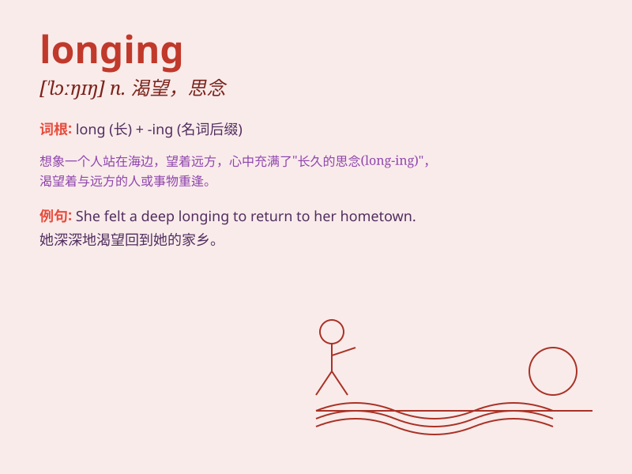

## longing

**英音:** _[\'lɒŋɪŋ]_ **美音:** _[\'lɔŋɪŋ]_

**译义:** *n.渴望*

### 短语

+ **longing for:** _渴望，向往_

+ **intense longing:** _强烈的渴望_

+ **unfulfilled longing:** _未实现的渴望_

+ **deep longing:** _深深的渴望_

+ **heartfelt longing:** _衷心的渴望_

### 例句

#### 例句1

> **She felt a deep longing for her childhood home.**

**中文翻译:** 她对儿时的家怀有深深的思念。

**单词释义:** 渴望；向往

#### 例句2

> **His eyes were filled with longing as he watched the couple
dance.**

**中文翻译:** 看着这对情侣跳舞，他的眼里充满了渴望。

**单词释义:** 渴望；热望

#### 例句3

> **The longing for adventure led him to travel the world.**

**中文翻译:** 对冒险的渴望促使他环游世界。

**单词释义:** 渴望；憧憬

### 背诵小故事

> A young girl was separated from her family. Every night, she looked
at the stars, feeling a deep longing to be reunited. This longing was a
powerful emotion that filled her heart.

**一个年轻的女孩与家人分离。每晚，她望着星星，心中充满了深深的渴望，渴望与家人团聚。这种渴望是一种强烈的情感，充满了她的内心。**

### 图义

