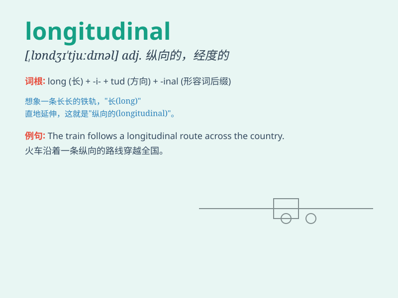

## longitudinal

**英音:** _[,lɒn(d)ʒɪ\'tjuːdɪn(ə)l; ,lɒŋgɪ-]_ **美音:**
_[,lɑndʒə\'tudnl]_

**译义:** *adj.经度的,纵向的*

### 短语

+ **longitudinal study:** _纵向研究；纵贯研究_

+ **longitudinal section:** _纵切面；纵剖面_

+ **longitudinal wave:** _纵波_

+ **longitudinal axis:** _纵轴_

+ **longitudinal reinforcement:** _纵向钢筋；纵向加固_

### 例句

#### 例句1

> **The longitudinal study followed the participants for ten
years.**

**中文翻译:** 这项纵向研究跟踪了参与者十年。

**单词释义:** 纵向的

#### 例句2

> **The ship has a longitudinal crack on its hull.**

**中文翻译:** 该船的船体上有一条纵向裂缝。

**单词释义:** 纵向的

#### 例句3

> **The longitudinal axis of the building runs from north to
south.**

**中文翻译:** 建筑的纵轴线从北向南延伸。

**单词释义:** 纵向的

### 背诵小故事

>
想象一下，有一条长长的铁路轨道（longitudinal），沿着山脉蜿蜒伸展。它的方向始终是纵向的，就像这个单词所表达的那样，一直延伸，没有偏离。

**想象一条沿着山脉纵向延伸的铁路轨道来辅助记忆'longitudinal'，意为纵向的**

### 图义

