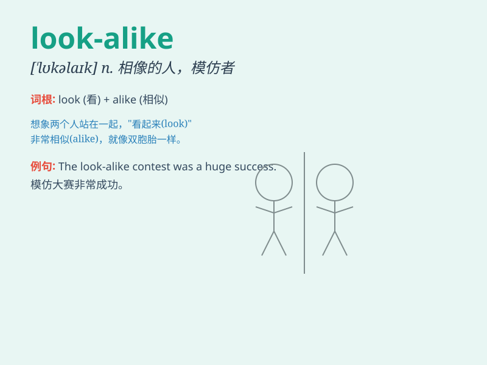

## look-alike

**英音:** _[ˈlʊkəlaɪk]_ **美音:** _[ˈlʊkəlaɪk]_

**译义:** *n.外观相似的人或物；adj.外观相似的，相像的*

### 短语

+ **dead ringer / look-alike:**
_酷似某人的人；与某人长得一模一样的人_

+ **a look-alike contest:** _模仿秀比赛_

+ **celebrity look-alike:** _名人的相似者_

+ **look-alike twins:** _长得相似的双胞胎_

+ **look-alike models:** _相似的模特_

### 例句

#### 例句1

> **The celebrity has many look-alikes who try to imitate her
style.**

**中文翻译:** 这位名人有很多长得像她的人试图模仿她的风格。

**单词释义:** 长得极像的人

#### 例句2

> **The two paintings are look-alikes, but one is a fake.**

**中文翻译:** 这两幅画很相似，但其中一幅是赝品。

**单词释义:** 相似的东西

#### 例句3

> **She was mistaken for a look-alike of the princess.**

**中文翻译:** 她被误认为是公主的相似者。

**单词释义:** 相像的人

### 背诵小故事

> One day, I was walking in the park and saw a person who was a
look-alike of my friend. I almost mistook him for my friend. But when I
got closer, I realized it wasn\'t. It was such a confusing moment!

**有一天，我在公园散步，看到一个长得很像我朋友的人。我差点把他错认成我的朋友。但走近一看，才发现不是。真是令人困惑的一刻！**

### 图义

