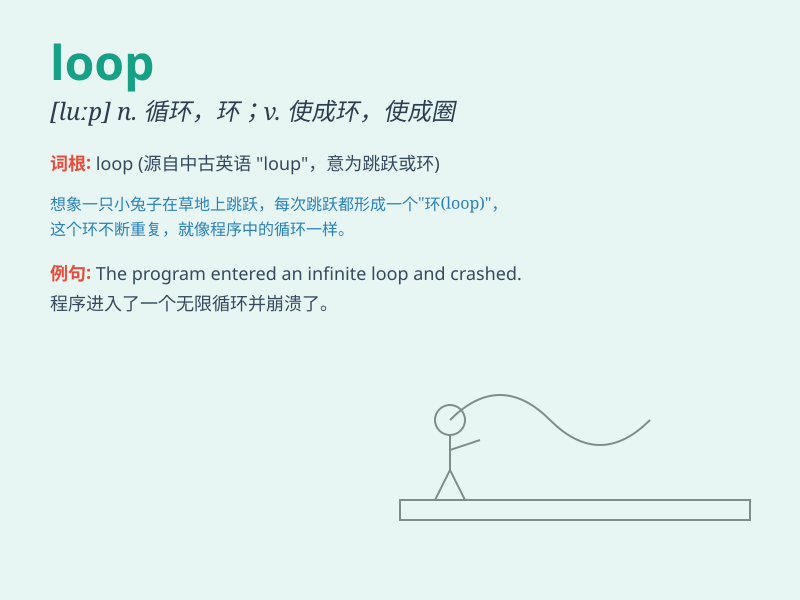

## loop

**英音:** _[luːp]_ **美音:** _[lup]_

**译义:**
*n.环,线(绳)圈,弯曲部分,回路,回线,(铁路)让车道,(飞机)翻圈飞行vt.使成环,以圈结,以环连结vi.打环,翻筋斗n.循环*

### 短语

+ **in the loop:** _在决策圈内；在消息圈内_

+ **loop hole:** _漏洞；空子_

+ **feedback loop:** _反馈回路；反馈环_

+ **closed loop:** _闭环；闭合回路_

+ **current loop:** _电流回路_

### 例句

#### 例句1

> **The path forms a loop around the lake.**

**中文翻译:** 这条小路绕着湖形成一个环。

**单词释义:** 环；圈

#### 例句2

> **She got stuck in a loop of negative thinking.**

**中文翻译:** 她陷入了消极思维的循环之中。

**单词释义:** 循环；周期

#### 例句3

> **The computer program contains a loop that repeats the process
several times.**

**中文翻译:** 计算机程序包含一个重复该过程多次的循环。

**单词释义:** （程序中的）循环

### 背诵小故事

> A little monkey was playing in the forest. It found a rope and
started swinging it like a loop. It had so much fun going around and
around. The loop made the monkey laugh!

**一只小猴子在森林里玩耍。它发现了一根绳子，并开始像一个环一样摆动它。它一圈又一圈地玩得很开心。这个环让猴子大笑！**

### 图义

