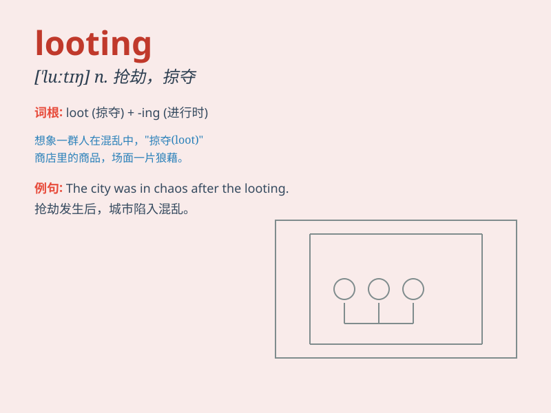

## looting

**英音:** _[ˈluːtɪŋ]_ **美音:** _[ˈluːtɪŋ]_

**译义:** *n.抢劫；掠夺 v.打劫；掠夺（loot 的现在分词）*

### 短语

+ **engage in looting:** _参与抢劫_

+ **prevent looting:** _防止抢劫_

+ **widespread looting:** _广泛的抢劫_

+ **stop looting:** _制止抢劫_

+ **random looting:** _随机抢劫_

### 例句

#### 例句1

> **The looting after the earthquake was a serious problem.**

**中文翻译:** 地震后的抢劫是一个严重的问题。

**单词释义:** 抢劫

#### 例句2

> **The police were trying to stop the looting of shops.**

**中文翻译:** 警察正在努力阻止对商店的抢劫。

**单词释义:** 抢劫

#### 例句3

> **There was widespread looting during the riots.**

**中文翻译:** 在骚乱期间，到处都有抢劫发生。

**单词释义:** 抢劫

### 背诵小故事

> In a chaotic city, after a major disaster, some bad people were
engaged in looting. They broke into stores and took away valuable goods.
The police arrived quickly to stop this illegal act.

**在一个混乱的城市里，一场大灾难过后，一些坏人在进行抢劫。他们闯入商店并拿走了贵重物品。警察迅速赶到制止了这种非法行为。**

### 图义

