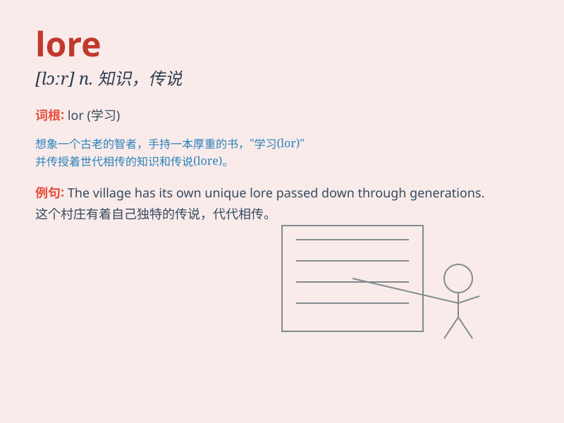

## lore

**英音:** _[lɔː]_ **美音:** _[lɔr]_

**译义:** *n.学问,知识,(动物的)眼光知识*

### 短语

+ **folklore:** _民间传说；民俗；民间传统_

+ **mythical lore:** _神话传说_

+ **traditional lore:** _传统知识；传统学问_

+ **ancient lore:** _古代知识；古老传说_

+ **local lore:** _当地传说；地方知识_

### 例句

#### 例句1

> **The old man was a keeper of ancient lore.**

**中文翻译:** 这位老人是古代知识的守护者。

**单词释义:** 知识；传说；学问

#### 例句2

> **The game is based on Celtic lore.**

**中文翻译:** 该游戏基于凯尔特人的传说。

**单词释义:** 传说；传统

#### 例句3

> **She spent years studying the lore of herbal medicine.**

**中文翻译:** 她花了数年时间研究草药知识。

**单词释义:** 知识；学问

### 背诵小故事

> A young adventurer was lost in a mysterious forest. An old wise man
told him tales of the forest\'s lore to help him find his way. The lore
included secret paths and hidden dangers. With this knowledge, the
adventurer finally escaped.

**一位年轻的冒险者在神秘森林中迷路了。一位年长的智者给他讲述了森林的知识和传说来帮助他找到出路。这些知识包括秘密路径和隐藏的危险。凭借这些知识，冒险者最终逃脱了。**

### 图义

