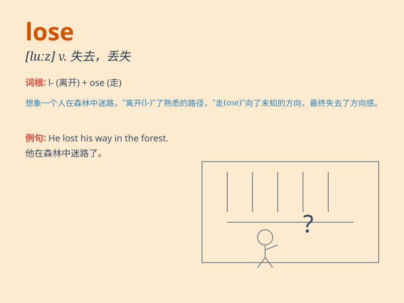

## lose

**英音:** _[luːz]_ **美音:** _[luz]_

**译义:**
*vt.遗失,浪费,错过,输去,使失去,使迷路,使沉溺于vi.受损失,失败*

### 短语

+ **lose heart:** _丧失信心；灰心_

+ **lose weight:** _减肥；体重减轻_

+ **lose one\'s way:** _迷路_

+ **lose face:** _丢脸；失面子_

+ **lose touch:** _失去联系_

### 例句

#### 例句1

> **I lost my keys yesterday.**

**中文翻译:** 我昨天丢了钥匙。

**单词释义:** 丢失

#### 例句2

> **If you don\'t study hard, you will lose the chance to go to a
good university.**

**中文翻译:** 如果你不努力学习，你就会失去上好大学的机会。

**单词释义:** 失去

#### 例句3

> **Our team lost the game last week.**

**中文翻译:** 我们队上周输掉了比赛。

**单词释义:** 输掉

### 背诵小故事

> One day, Tom was in a hurry to go to school and he lost his favorite
pen. He looked everywhere but couldn\'t find it. He was very sad. From
then on, he learned to be more careful.

**有一天，汤姆匆忙去上学，结果弄丢了他最喜欢的钢笔。他到处找但都找不到。他非常伤心。从那以后，他学会了要更小心。**

### 图义

