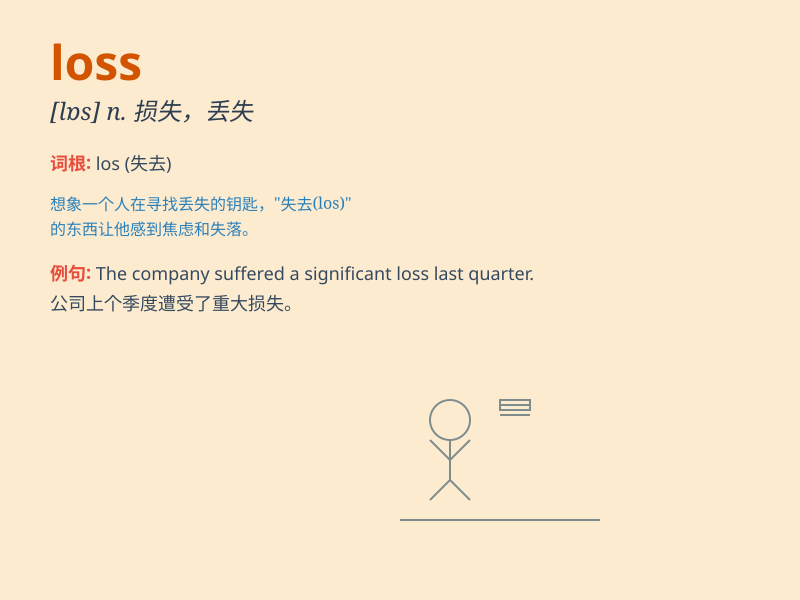

## loss

**英音:** _[lɒs]_ **美音:** _[lɔs]_

**译义:** *n.损失,遗失,失败,输,浪费,错过,[军]伤亡,降低*

### 短语

+ **loss of:** _丧失；损失_

+ **weight loss:** _体重减轻_

+ **profit and loss:** _损益；盈利和亏损_

+ **at a loss:** _困惑；不知所措_

+ **loss prevention:** _损失预防；防损_

### 例句

#### 例句1

> **The company suffered a huge loss last year.**

**中文翻译:** 该公司去年遭受了巨额亏损。

**单词释义:** 损失

#### 例句2

> **His death was a great loss to the community.**

**中文翻译:** 他的去世是社会的巨大损失。

**单词释义:** 损失；丧失

#### 例句3

> **The loss of her job was a big blow to her.**

**中文翻译:** 失业对她来说是一个很大的打击。

**单词释义:** 失去；丧失

### 背诵小故事

> A merchant was very sad because of a big loss in his business. He
lost a lot of money and goods. But he didn\'t give up and finally found
a way to make up for the loss.

**一位商人因为生意上的重大损失非常伤心。他损失了很多钱和货物。但他没有放弃，最终找到了弥补损失的方法。**

### 图义

