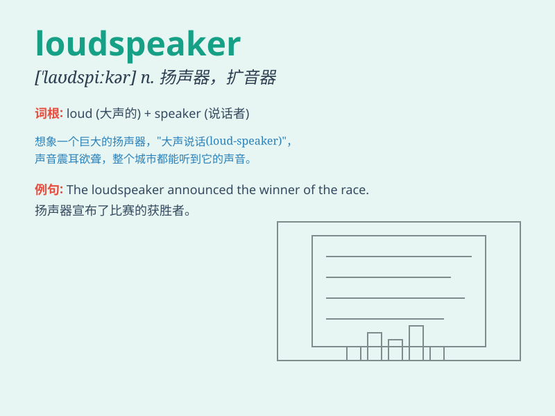

## loudspeaker

**英音:** _[laʊd\'spiːkə]_ **美音:** _[,laʊd\'spikɚ]_

**译义:** *n.扩音器,喇叭*

### 短语

+ **public address loudspeaker:** _公共广播扬声器_

+ **wireless loudspeaker:** _无线扬声器_

+ **portable loudspeaker:** _便携式扬声器_

+ **outdoor loudspeaker:** _户外扬声器_

+ **car loudspeaker:** _汽车扬声器_

### 例句

#### 例句1

> **The loudspeaker announced the start of the event.**

**中文翻译:** 喇叭宣布活动开始。

**单词释义:** 扬声器

#### 例句2

> **The sound from the loudspeaker was distorted.**

**中文翻译:** 扬声器发出的声音失真了。

**单词释义:** 扬声器

#### 例句3

> **He fixed the broken loudspeaker in the classroom.**

**中文翻译:** 他修好了教室里坏掉的扬声器。

**单词释义:** 扬声器

### 背诵小故事

> One day, at a noisy party, the music was so loud. But no one could
hear clearly. Then, a hero appeared - the loudspeaker. It amplified the
sound and made everyone enjoy the party.

**有一天，在一个嘈杂的派对上，音乐声很大但没人能听清。这时，一个英雄出现了------扬声器。它放大了声音，让每个人都尽情享受派对。**

### 图义

