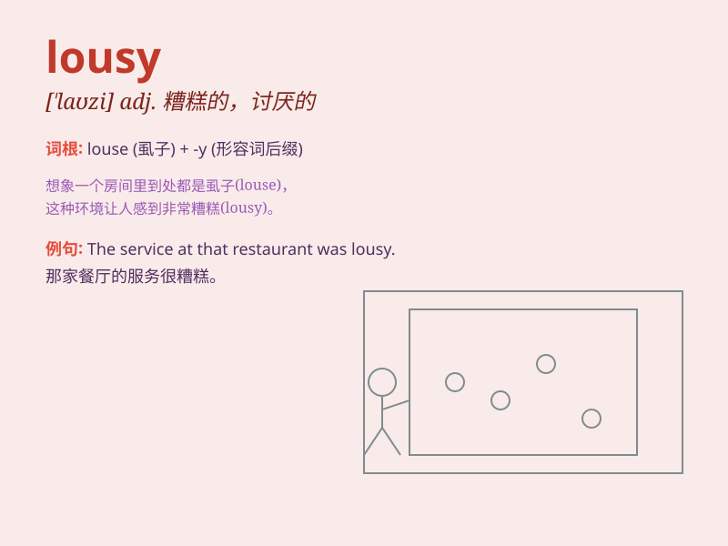

## lousy

**英音:** _[\'laʊzɪ]_ **美音:** _[\'laʊzi]_

**译义:** *adj.\<俚>污秽的,恶心的,生虱的*

### 短语

+ **lousy weather:** _恶劣的天气_

+ **lousy job:** _糟糕的工作_

+ **feel lousy:** _感觉不舒服；感觉糟糕_

+ **lousy service:** _差劲的服务_

+ **a lousy excuse:** _一个蹩脚的借口_

### 例句

#### 例句1

> **The food at that restaurant was lousy.**

**中文翻译:** 那家餐厅的食物很糟糕。

**单词释义:** 糟糕的；差劲的

#### 例句2

> **I had a lousy day at work today.**

**中文翻译:** 我今天工作很糟糕。

**单词释义:** 令人讨厌的；恶劣的

#### 例句3

> **His lousy attitude really annoys me.**

**中文翻译:** 他恶劣的态度真让我恼火。

**单词释义:** 极坏的；恶劣的

### 背诵小故事

> There was a lousy thief who always failed in stealing. One day, he
tried to steal a loaf of bread but got caught immediately. People called
him a lousy criminal.

**有一个差劲的小偷，他总是偷窃失败。有一天，他试图偷一条面包，但马上就被抓住了。人们称他是个糟糕的罪犯。**

### 图义

