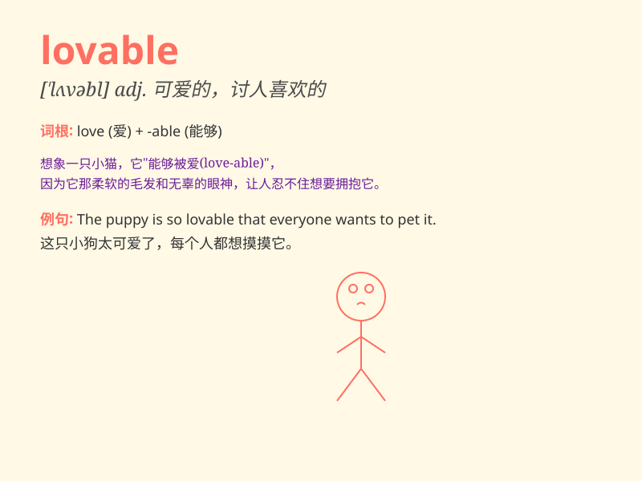

## lovable

**英音:** _[ˈlʌvəbl]_ **美音:** _[ˈlʌvəbl]_

**译义:** *adj.可爱的,惹人爱的*

### 短语

+ **lovable character:** _可爱的性格_

+ **lovable pet:** _可爱的宠物_

+ **lovable smile:** _可爱的微笑_

+ **extremely lovable:** _极其可爱_

+ **innocently lovable:** _天真可爱_

### 例句

#### 例句1

> **The puppy is so lovable with its big eyes and wagging tail.**

**中文翻译:** 这只小狗有着大大的眼睛和摇着的尾巴，非常可爱。

**单词释义:** 可爱的

#### 例句2

> **She has a lovable personality that makes everyone like her.**

**中文翻译:** 她有一种可爱的性格，让每个人都喜欢她。

**单词释义:** 可爱的；讨人喜欢的

#### 例句3

> **The children\'s innocent smiles are simply lovable.**

**中文翻译:** 孩子们天真的笑容简直惹人喜爱。

**单词释义:** 可爱的；惹人爱的

### 背诵小故事

> Once upon a time, there was a little puppy. It was always friendly
and made everyone smile. Its cute look and kind heart made it extremely
lovable. People couldn\'t help but want to hug and play with it.

**从前，有一只小狗。它总是很友好，让每个人都微笑。它可爱的外表和善良的心使它非常惹人喜爱。人们忍不住想要拥抱和跟它玩耍。**

### 图义

