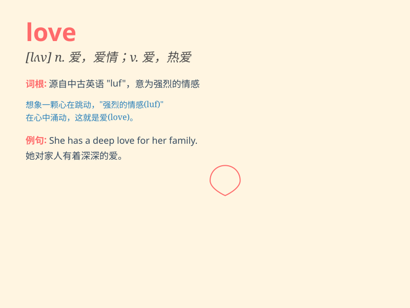

## love

**英音:** _[lʌv]_ **美音:** _[lʌv]_

**译义:**
*n.爱,热爱,爱情,爱好,性爱,情人,零vt.爱,热爱,爱好,爱慕vi.爱*

### 短语

+ **fall in love:** _坠入爱河；相爱_

+ **love affair:** _风流韵事；恋爱事件_

+ **love letter:** _情书_

+ **love story:** _爱情故事_

+ **unconditional love:** _无条件的爱_

### 例句

#### 例句1

> **I love my family very much.**

**中文翻译:** 我非常爱我的家人。

**单词释义:** 爱

#### 例句2

> **She fell in love with the city at first sight.**

**中文翻译:** 她对这座城市一见钟情。

**单词释义:** 爱上

#### 例句3

> **Love makes the world go round.**

**中文翻译:** 爱让世界运转。

**单词释义:** 爱（泛指）

### 背诵小故事

> Once upon a time, there was a boy. He always cared for a girl, did
nice things for her, and thought about her all the time. This feeling he
had was love. It made him happy and willing to do anything for her.

**从前，有一个男孩。他总是关心一个女孩，为她做好事，时刻想着她。他的这种感觉就是爱。这让他快乐，愿意为她做任何事。**

### 图义

