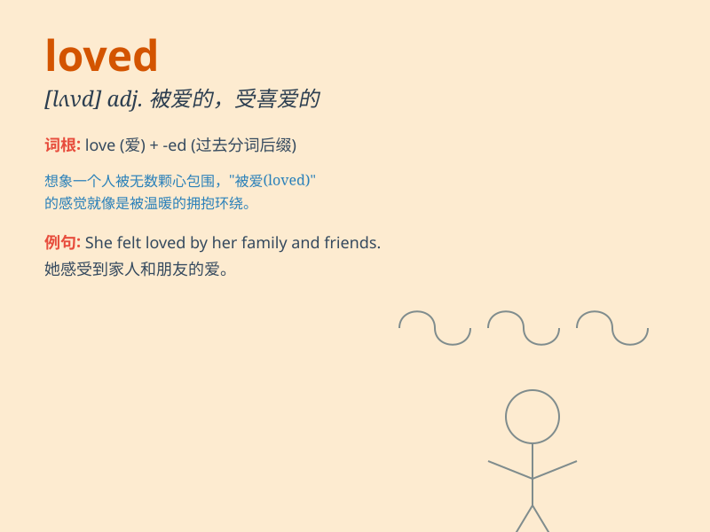

## loved

**英音:** _[lʌvd]_ **美音:** _[lʌvd]_

**译义:** *v. 爱, 喜爱 (love的过去式和过去分词)*

### 短语

+ **be loved up:** _沉浸在爱中_

+ **much loved:** _深受喜爱的_

+ **well-loved:** _备受钟爱的_

+ **beloved of:** _为......所喜爱_

+ **loved one:** _心爱的人_

### 例句

#### 例句1

> **I loved the movie we watched last night.**

**中文翻译:** 我喜欢我们昨晚看的那部电影。

**单词释义:** 喜欢

#### 例句2

> **She has always loved reading books.**

**中文翻译:** 她一直喜爱读书。

**单词释义:** 喜爱

#### 例句3

> **He loved his hometown deeply.**

**中文翻译:** 他深深地爱着他的家乡。

**单词释义:** 爱

### 背诵小故事

> A girl was always alone and felt sad. One day, she met a kind boy who
showed her love and care. She felt truly loved. From then on, she smiled
every day. The love she received changed her life.

**一个女孩总是独自一人，感到悲伤。有一天，她遇到了一个善良的男孩，男孩向她表达了爱和关心。她感受到了真正的被爱。从那以后，她每天都微笑。她所得到的爱改变了她的生活。**

### 图义

