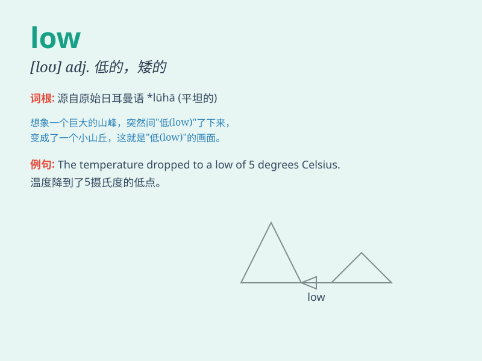

## low

**英音:** _[ləʊ]_ **美音:** _[loʊ]_

**译义:**
*n.低,低价,牛叫声adj.低的,浅的,消沉的,微弱的,粗俗的,卑贱的,体质弱的adv.低下地,谦卑地,低声地,低价地vi.牛叫*

### 短语

+ **low pressure:** _低气压_

+ **low cost:** _低成本_

+ **low temperature:** _低温_

+ **low profile:** _低调_

+ **low spirits:** _情绪低落_

### 例句

#### 例句1

> **The sun was low in the sky.**

**中文翻译:** 太阳低垂在天空中。

**单词释义:** 低的；矮的

#### 例句2

> **The price of the stock is at a low point.**

**中文翻译:** 股票价格处于低点。

**单词释义:** 低的；少的

#### 例句3

> **She has a low opinion of him.**

**中文翻译:** 她对他的评价很低。

**单词释义:** 差的；劣等的

### 背诵小故事

> A little mouse was looking for food in a low cave. It had to bend
down to enter. But it was happy as there was plenty of cheese. The cave
was low but full of surprises.

**一只小老鼠在一个低矮的洞穴里寻找食物。它不得不弯腰才能进去。但它很高兴，因为那里有很多奶酪。这个洞穴很低，但充满了惊喜。**

### 图义

