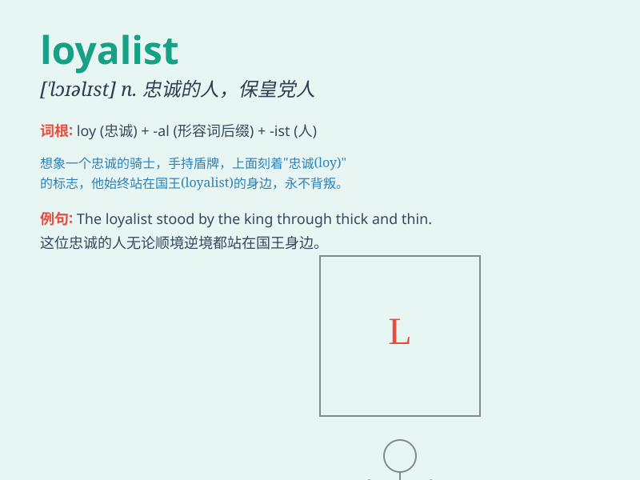

## loyalist

**英音:** _[\'lɒɪəlɪst]_ **美音:** _[\'lɔɪəlɪst]_

**译义:** *n.忠诚的人,反对独立者*

### 短语

+ **loyalist supporter:** _忠诚的支持者_

+ **political loyalist:** _政治上的忠诚者_

+ **staunch loyalist:** _坚定的拥护者_

+ **loyalist faction:** _忠诚派_

+ **royalist loyalist:** _保皇党忠诚分子_

### 例句

#### 例句1

> **He has always been a loyalist to the company, working hard for
its success.**

**中文翻译:** 他一直是公司的忠实拥护者，为公司的成功而努力工作。

**单词释义:** 忠实拥护者

#### 例句2

> **The loyalist remained true to the king even in difficult
times.**

**中文翻译:** 即使在困难时期，忠诚者仍然忠于国王。

**单词释义:** 忠诚者

#### 例句3

> **The party has many loyalists who will support it through thick
and thin.**

**中文翻译:** 该党有许多忠实拥护者，他们将同甘共苦地支持它。

**单词释义:** 忠实信徒

### 背诵小故事

> In a kingdom under threat, a brave knight always stood by the king.
No matter how difficult the situation, he remained true. This knight was
a loyalist. He was known for his unwavering loyalty to the throne.

**在一个受到威胁的王国里，一位勇敢的骑士总是站在国王身边。无论情况多么艰难，他都始终如一。这位骑士就是一个忠诚者。他因对王位坚定不移的忠诚而闻名。**

### 图义

