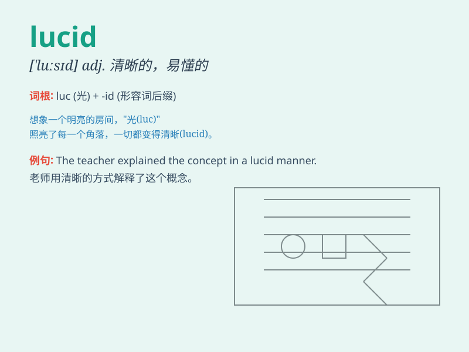

## lucid

**英音:** _[\'luːsɪd]_ **美音:** _[\'lusɪd]_

**译义:** *adj.明晰的*

### 短语

+ **lucid dream:** _清醒梦；清明梦_

+ **lucid interval:** _清醒期间；神志清醒的间歇_

+ **lucid explanation:** _清晰的解释_

+ **lucid thinking:** _清晰的思维_

+ **lucid moment:** _清醒时刻_

### 例句

#### 例句1

> **His writing is lucid and easy to understand.**

**中文翻译:** 他的写作清晰易懂。

**单词释义:** 清晰的

#### 例句2

> **Even in a stressful situation, she remained lucid and calm.**

**中文翻译:** 即使在压力很大的情况下，她仍然保持清醒和冷静。

**单词释义:** 头脑清醒的

#### 例句3

> **The professor gave a lucid explanation of the complex theory.**

**中文翻译:** 教授对这个复杂的理论进行了清晰的解释。

**单词释义:** 清晰的

### 背诵小故事

> In a deep forest, there was a wise old owl. Its eyes were always
lucid, seeing clearly through the darkness. It guided lost animals with
its sharp and clear vision. Remember the owl\'s lucid eyes to remember
this word.

**在一片幽深的森林里，有一只睿智的老猫头鹰。它的眼睛总是清澈明亮的，能在黑暗中清晰地看清一切。它凭借敏锐清晰的视力为迷路的动物指引方向。记住猫头鹰清澈的眼睛就能记住这个单词。**

### 图义

