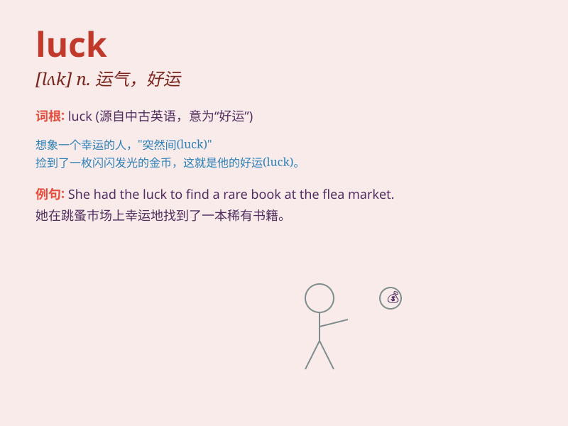

## luck

**英音:** _[lʌk]_ **美音:** _[lʌk]_

**译义:** *n.运气,好运,幸运*

### 短语

+ **good luck:** _好运；幸运_

+ **bad luck:** _厄运；倒霉_

+ **by luck:** _侥幸；靠运气_

+ **out of luck:** _运气不好；倒霉_

+ **try one\'s luck:** _碰运气_

### 例句

#### 例句1

> **Good luck with your exam!**

**中文翻译:** 祝你考试顺利！

**单词释义:** 好运；幸运

#### 例句2

> **She had the luck to find a good job.**

**中文翻译:** 她很幸运地找到了一份好工作。

**单词释义:** 幸运；运气

#### 例句3

> **It was just luck that I won the lottery.**

**中文翻译:** 我中了彩票只是运气好而已。

**单词释义:** 运气；好运

### 背诵小故事

> One day, Tom was lost in the forest. Just when he felt hopeless, he
found a path that led him out. It was all due to his luck. He realized
that sometimes, luck can bring unexpected good things.

**一天，汤姆在森林里迷路了。就在他感到绝望的时候，他发现了一条能带他出去的小路。这都归功于他的运气。他意识到有时候，运气能带来意想不到的好事。**

### 图义

