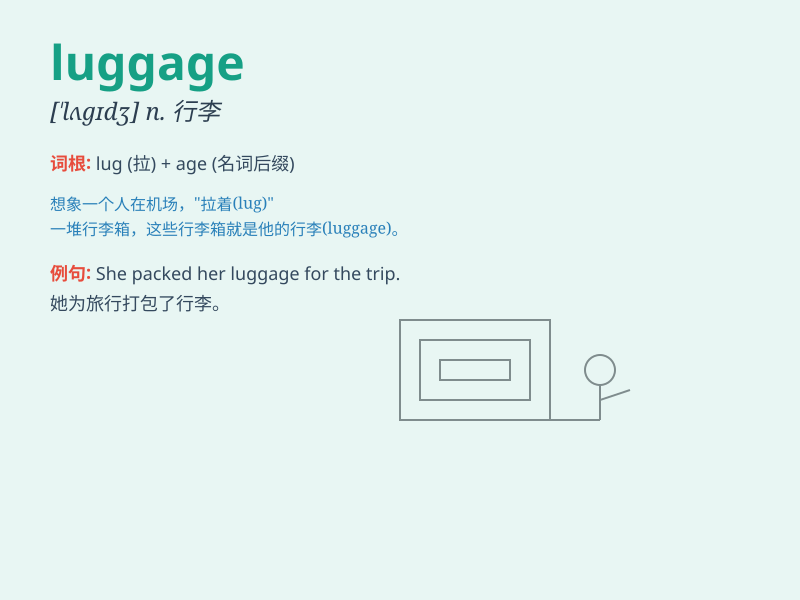

## luggage

**英音:** _[\'lʌgɪdʒ]_ **美音:** _[\'lʌɡɪdʒ]_

**译义:** *n.行李,皮箱*

### 短语

+ **hand luggage:** _手提行李_

+ **excess luggage:** _超重行李_

+ **luggage allowance:** _行李限额_

+ **luggage claim:** _行李领取处_

+ **luggage tag:** _行李标签_

### 例句

#### 例句1

> **I have a lot of luggage to carry.**

**中文翻译:** 我有很多行李要搬。

**单词释义:** 行李

#### 例句2

> **The airline lost my luggage.**

**中文翻译:** 航空公司丢失了我的行李。

**单词释义:** 行李

#### 例句3

> **She was struggling with her heavy luggage.**

**中文翻译:** 她正拖着沉重的行李。

**单词释义:** 行李

### 背诵小故事

> One day, Tom went to the airport. He had a lot of luggage - big
suitcases and small bags. But he was worried because he might lose his
luggage. Finally, with care, he safely took all his luggage to the
destination.

**有一天，汤姆去机场。他有很多行李 -
大行李箱和小袋子。但他很担心，因为他可能会弄丢他的行李。最后，小心翼翼地，他把所有行李安全地带到了目的地。**

### 图义

