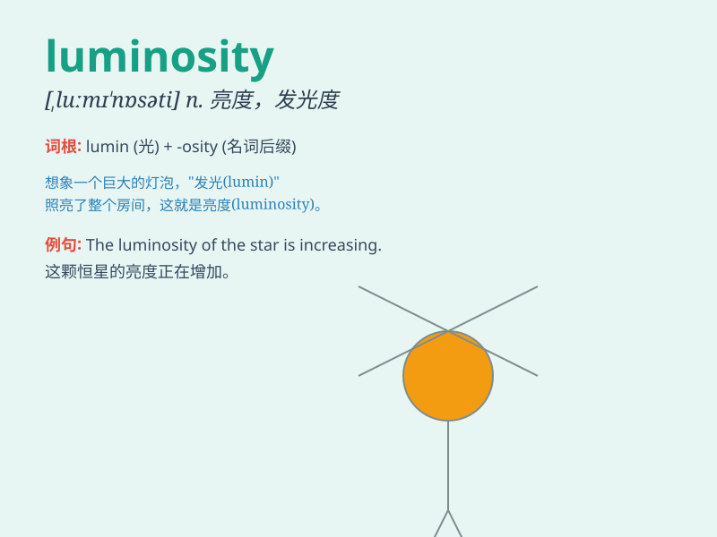

## luminosity

**英音:** _[luːmɪ\'nɒsətɪ]_ **美音:** _[,lʊmə\'nɑsəti]_

**译义:** *n.发光度*

### 短语

+ **luminosity curve:** _光度曲线_

+ **luminosity class:** _光度级_

+ **luminosity distance:** _光度距离_

+ **luminosity function:** _光度函数_

+ **surface luminosity:** _表面光度_

### 例句

#### 例句1

> **The luminosity of the stars in the night sky is breathtaking.**

**中文翻译:** 夜空中星星的光度令人叹为观止。

**单词释义:** 光度

#### 例句2

> **The luminosity of the new light bulb is much higher than the old
one.**

**中文翻译:** 新灯泡的亮度比旧灯泡高很多。

**单词释义:** 发光度

#### 例句3

> **Scientists are studying the luminosity of distant galaxies to
understand their evolution.**

**中文翻译:** 科学家们正在研究遥远星系的光度，以了解它们的演化。

**单词释义:** 光度

### 背诵小故事

> In a dark cave, a mysterious gem emitted a brilliant light. This
light was so intense that it filled the entire cave. The quality of this
bright light was called \'luminosity\'.

**在一个黑暗的洞穴里，一颗神秘的宝石发出了耀眼的光芒。这光芒如此强烈，照亮了整个洞穴。这种明亮光芒的特质就被称为"光度"。**

### 图义

